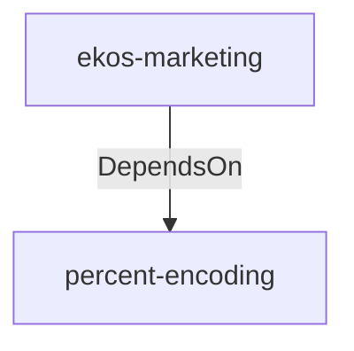

# percent-encoding (Technology)

## Properties

_No compiled properties._

## Relationships

### DependsOn

- ← ekos-marketing (`18dba45d-9534-5035-bd6f-df6b370079ac`) — evidence: ekos-marketing depends on percent-encoding 2

## Diagram

## Evidence

- `24fa1891-7f1e-48f7-96dd-bfee99644358` — ekos-marketing depends on percent-encoding 2 (confidence: 1.00)
