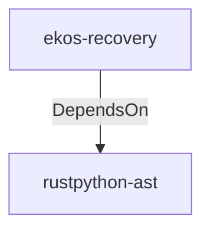

# rustpython-ast (Technology)

## Properties

_No compiled properties._

## Relationships

### DependsOn

- ← ekos-recovery (`28244ebb-4e16-5e8d-a637-5e750d01f2b8`) — evidence: ekos-recovery depends on rustpython-ast 0.4

## Diagram

## Evidence

- `c246ffc7-aa18-493a-91cf-d39743115965` — ekos-recovery depends on rustpython-ast 0.4 (confidence: 1.00)
- `6be41aec-edad-4107-9eaa-9ec903f49833` — ekos-recovery depends on rustpython-parser 0.4 (confidence: 1.00)
