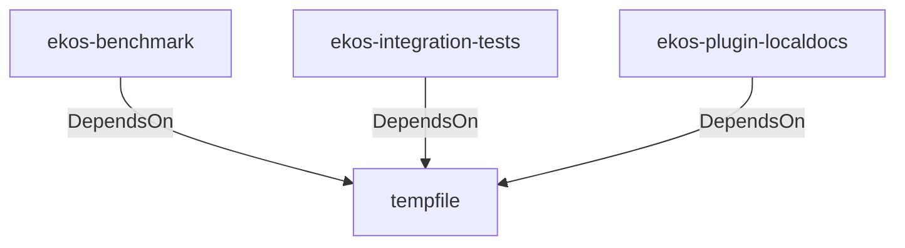

# tempfile (Technology)

## Properties

_No compiled properties._

## Relationships

### DependsOn

- ← ekos-benchmark (`20c26e43-ee96-5ee7-a046-25740fbbd56b`) — evidence: ekos-benchmark depends on tempfile 3
- ← ekos-integration-tests (`063808f9-5f19-5d62-b3dd-69eaa93d44cb`) — evidence: ekos-integration-tests depends on tempfile 3
- ← ekos-plugin-localdocs (`0659fbf3-d2f4-54ba-835f-a7f6f875a7d1`) — evidence: ekos-plugin-localdocs depends on tempfile 3

## Diagram

## Evidence

- `dadb8182-10c7-4e77-9013-64d4c6888734` — ekos-benchmark depends on tempfile 3 (confidence: 1.00)
- `7101b326-3465-4bc8-be66-e0668a77e54c` — ekos-integration-tests depends on tempfile 3 (confidence: 1.00)
- `d6d089fa-5c32-4927-b395-814c4fc02834` — ekos-plugin-localdocs depends on tempfile 3 (confidence: 1.00)
