# thiserror (Technology)

## Properties

_No compiled properties._

## Relationships

### DependsOn

- ← ekos-identity (`2c6b8d9a-83ed-510e-a5d8-a76f2e8685fe`) — evidence: ekos-identity depends on thiserror 2
- ← ekos-semantic (`f82d9ce0-df2a-5af8-9f9a-2bd5f8484839`) — evidence: ekos-semantic depends on thiserror 2
- ← ekos-runtime (`f4cd2d3b-f0b0-5234-ab2b-39de3275d717`) — evidence: ekos-runtime depends on thiserror 2
- ← ekos-compiler-core (`2690bc0d-0233-516f-b969-9e87432f623d`) — evidence: ekos-compiler-core depends on thiserror 2
- ← ekos-kir (`7e3bc0de-d888-55cd-aa9a-f333f6e2cbb2`) — evidence: ekos-kir depends on thiserror 2
- ← ekos-observation-sdk (`9a955a3a-55bc-587a-942d-fb81d6260052`) — evidence: ekos-observation-sdk depends on thiserror 2
- ← ekos-artifact (`8806bf54-6364-5052-b85a-cef4344e8f19`) — evidence: ekos-artifact depends on thiserror 2
- ← ekos-common (`dc169f0a-98f1-5c7c-8dd0-1dbc8504e9c9`) — evidence: ekos-common depends on thiserror 2
- ← ekos-marketing (`18dba45d-9534-5035-bd6f-df6b370079ac`) — evidence: ekos-marketing depends on thiserror 2
- ← ekos-ekl (`d932eaf4-7069-5419-a00c-fa4b7b374c86`) — evidence: ekos-ekl depends on thiserror 2
- ← ekos-recovery (`28244ebb-4e16-5e8d-a637-5e750d01f2b8`) — evidence: ekos-recovery depends on thiserror 2
- ← ekos-ledger (`9c977335-c421-519c-a889-558f0487574e`) — evidence: ekos-ledger depends on thiserror 2
- ← ekos-plugin-oracle (`66e4bdc1-07c6-5f6e-9150-d6db731cf29d`) — evidence: ekos-plugin-oracle depends on thiserror 2
- ← ekos-plugin-confluence (`e8d1a3c9-e7b2-5084-bdfc-569e7b604054`) — evidence: ekos-plugin-confluence depends on thiserror 2
- ← ekos-plugin-localdocs (`0659fbf3-d2f4-54ba-835f-a7f6f875a7d1`) — evidence: ekos-plugin-localdocs depends on thiserror 2
- ← ekos-plugin-sap (`870bf8c4-5212-524c-a442-6fe561baf29d`) — evidence: ekos-plugin-sap depends on thiserror 2
- ← ekos-plugin-github (`aff4d491-b33f-56d7-b0ba-e03e884983fd`) — evidence: ekos-plugin-github depends on thiserror 2
- ← ekos-plugin-pentaho (`dac1d743-a50e-57a9-8acb-56e29a47ef5e`) — evidence: ekos-plugin-pentaho depends on thiserror 2
- ← ekos-plugin-file (`06b65958-abb7-5fe1-a6ee-d35946d39062`) — evidence: ekos-plugin-file depends on thiserror 2
- ← ekos-plugin-python (`020c78ca-f337-542f-b351-8b4201393bbb`) — evidence: ekos-plugin-python depends on thiserror 2
- ← ekos-plugin-git (`df977fc8-e004-518e-b267-581520ccd448`) — evidence: ekos-plugin-git depends on thiserror 2
- ← ekos-plugin-fabric (`aeb0688d-1d00-58a5-b6d6-245dfefa74cf`) — evidence: ekos-plugin-fabric depends on thiserror 2
- ← ekos-plugin-snowflake (`0a005794-329c-5fc3-a395-a5c55cf9cfcb`) — evidence: ekos-plugin-snowflake depends on thiserror 2
- ← ekos-plugin-salesforce (`a9e38433-d550-5523-8c13-4f5c31f4e742`) — evidence: ekos-plugin-salesforce depends on thiserror 2
- ← ekos-plugin-crypto (`835d6e67-5bb0-53e7-9104-338881612548`) — evidence: ekos-plugin-crypto depends on thiserror 2
- ← ekos-plugin-rust (`07179bab-d486-5b14-8c68-6e743e45b3f6`) — evidence: ekos-plugin-rust depends on thiserror 2

## Diagram

```mermaid
graph TD
    nbbefe8a3f76e509f910bb439cd7eeff6["thiserror"]
    n2c6b8d9a83ed510ea5d8a76f2e8685fe["ekos-identity"]
    n2c6b8d9a83ed510ea5d8a76f2e8685fe -->|DependsOn| nbbefe8a3f76e509f910bb439cd7eeff6
    nf82d9ce0df2a5af89f9a2bd5f8484839["ekos-semantic"]
    nf82d9ce0df2a5af89f9a2bd5f8484839 -->|DependsOn| nbbefe8a3f76e509f910bb439cd7eeff6
    nf4cd2d3bf0b05234ab2b39de3275d717["ekos-runtime"]
    nf4cd2d3bf0b05234ab2b39de3275d717 -->|DependsOn| nbbefe8a3f76e509f910bb439cd7eeff6
    n2690bc0d0233516fb9699e87432f623d["ekos-compiler-core"]
    n2690bc0d0233516fb9699e87432f623d -->|DependsOn| nbbefe8a3f76e509f910bb439cd7eeff6
    n7e3bc0ded88855cdaa9af333f6e2cbb2["ekos-kir"]
    n7e3bc0ded88855cdaa9af333f6e2cbb2 -->|DependsOn| nbbefe8a3f76e509f910bb439cd7eeff6
    n9a955a3a55bc587a942dfb81d6260052["ekos-observation-sdk"]
    n9a955a3a55bc587a942dfb81d6260052 -->|DependsOn| nbbefe8a3f76e509f910bb439cd7eeff6
    n8806bf5463645052b85acef4344e8f19["ekos-artifact"]
    n8806bf5463645052b85acef4344e8f19 -->|DependsOn| nbbefe8a3f76e509f910bb439cd7eeff6
    ndc169f0a98f15c7c8dd01dbc8504e9c9["ekos-common"]
    ndc169f0a98f15c7c8dd01dbc8504e9c9 -->|DependsOn| nbbefe8a3f76e509f910bb439cd7eeff6
    n18dba45d95345035bd6fdf6b370079ac["ekos-marketing"]
    n18dba45d95345035bd6fdf6b370079ac -->|DependsOn| nbbefe8a3f76e509f910bb439cd7eeff6
    nd932eaf470695419a00cfa4b7b374c86["ekos-ekl"]
    nd932eaf470695419a00cfa4b7b374c86 -->|DependsOn| nbbefe8a3f76e509f910bb439cd7eeff6
    n28244ebb4e165e8da6375e750d01f2b8["ekos-recovery"]
    n28244ebb4e165e8da6375e750d01f2b8 -->|DependsOn| nbbefe8a3f76e509f910bb439cd7eeff6
    n9c977335c421519ca889558f0487574e["ekos-ledger"]
    n9c977335c421519ca889558f0487574e -->|DependsOn| nbbefe8a3f76e509f910bb439cd7eeff6
    n66e4bdc107c65f6e9150d6db731cf29d["ekos-plugin-oracle"]
    n66e4bdc107c65f6e9150d6db731cf29d -->|DependsOn| nbbefe8a3f76e509f910bb439cd7eeff6
    ne8d1a3c9e7b25084bdfc569e7b604054["ekos-plugin-confluence"]
    ne8d1a3c9e7b25084bdfc569e7b604054 -->|DependsOn| nbbefe8a3f76e509f910bb439cd7eeff6
    n0659fbf3d2f454ba835fa7f6f875a7d1["ekos-plugin-localdocs"]
    n0659fbf3d2f454ba835fa7f6f875a7d1 -->|DependsOn| nbbefe8a3f76e509f910bb439cd7eeff6
    n870bf8c45212524ca4426fe561baf29d["ekos-plugin-sap"]
    n870bf8c45212524ca4426fe561baf29d -->|DependsOn| nbbefe8a3f76e509f910bb439cd7eeff6
    naff4d491b33f56d7b0bae03e884983fd["ekos-plugin-github"]
    naff4d491b33f56d7b0bae03e884983fd -->|DependsOn| nbbefe8a3f76e509f910bb439cd7eeff6
    ndac1d743a50e57a98acb56e29a47ef5e["ekos-plugin-pentaho"]
    ndac1d743a50e57a98acb56e29a47ef5e -->|DependsOn| nbbefe8a3f76e509f910bb439cd7eeff6
    n06b65958abb75fe1a6eed35946d39062["ekos-plugin-file"]
    n06b65958abb75fe1a6eed35946d39062 -->|DependsOn| nbbefe8a3f76e509f910bb439cd7eeff6
    n020c78caf337542fb3518b4201393bbb["ekos-plugin-python"]
    n020c78caf337542fb3518b4201393bbb -->|DependsOn| nbbefe8a3f76e509f910bb439cd7eeff6
    ndf977fc8e004518eb267581520ccd448["ekos-plugin-git"]
    ndf977fc8e004518eb267581520ccd448 -->|DependsOn| nbbefe8a3f76e509f910bb439cd7eeff6
    naeb0688d1d0058a5b6d6245dfefa74cf["ekos-plugin-fabric"]
    naeb0688d1d0058a5b6d6245dfefa74cf -->|DependsOn| nbbefe8a3f76e509f910bb439cd7eeff6
    n0a005794329c5fc3a395a5c55cf9cfcb["ekos-plugin-snowflake"]
    n0a005794329c5fc3a395a5c55cf9cfcb -->|DependsOn| nbbefe8a3f76e509f910bb439cd7eeff6
    na9e38433d55055238c134f5c31f4e742["ekos-plugin-salesforce"]
    na9e38433d55055238c134f5c31f4e742 -->|DependsOn| nbbefe8a3f76e509f910bb439cd7eeff6
    n835d6e675bb053e79104338881612548["ekos-plugin-crypto"]
    n835d6e675bb053e79104338881612548 -->|DependsOn| nbbefe8a3f76e509f910bb439cd7eeff6
    n07179babd4865b148c686e743e45b3f6["ekos-plugin-rust"]
    n07179babd4865b148c686e743e45b3f6 -->|DependsOn| nbbefe8a3f76e509f910bb439cd7eeff6
```

## Evidence

- `ab774378-2d09-4bdd-9888-23e199b5107e` — ekos-identity depends on thiserror 2 (confidence: 1.00)
- `cf65e522-810c-46fb-b6f0-b0849eb2f282` — ekos-semantic depends on thiserror 2 (confidence: 1.00)
- `9b95acd5-11ac-4996-bd12-2565b2d2f814` — ekos-runtime depends on thiserror 2 (confidence: 1.00)
- `85bd8e7f-f495-4f21-acb2-80876bde42a7` — ekos-compiler-core depends on thiserror 2 (confidence: 1.00)
- `43a7f497-78a2-487e-a455-a5511f6fc129` — ekos-kir depends on thiserror 2 (confidence: 1.00)
- `cddb5c07-2f9a-45de-9880-3eae2f7f7c57` — ekos-observation-sdk depends on thiserror 2 (confidence: 1.00)
- `5098c0d0-2476-4fbc-a95d-a024993635b0` — ekos-artifact depends on thiserror 2 (confidence: 1.00)
- `2d030021-be96-4db7-862c-6db551f70b90` — ekos-common depends on thiserror 2 (confidence: 1.00)
- `f25ff774-79bb-4230-ae5a-d026359eaed8` — ekos-marketing depends on thiserror 2 (confidence: 1.00)
- `e9fae1a8-0d75-4078-a5f4-35bad47f37ec` — ekos-ekl depends on thiserror 2 (confidence: 1.00)
- `322a13e5-080e-44b1-b7c9-205bb228b5d8` — ekos-recovery depends on thiserror 2 (confidence: 1.00)
- `4ec63c1d-3a92-4a9b-8635-0e4cb55c4c30` — ekos-ledger depends on thiserror 2 (confidence: 1.00)
- `1b71385b-5b37-4704-9d43-5b77813b8110` — ekos-plugin-oracle depends on thiserror 2 (confidence: 1.00)
- `b87db043-49b2-4c35-9bc3-584494d66e58` — ekos-plugin-confluence depends on thiserror 2 (confidence: 1.00)
- `4f8b8598-c1f1-4908-b8d8-3fa0b4232fb1` — ekos-plugin-localdocs depends on thiserror 2 (confidence: 1.00)
- `1b14017d-b2d2-43cb-8aff-47a4a0621e5d` — ekos-plugin-sap depends on thiserror 2 (confidence: 1.00)
- `b4734db2-ffb6-4e36-b1a5-f4f13bf2907a` — ekos-plugin-github depends on thiserror 2 (confidence: 1.00)
- `bb548312-8732-480b-b2f1-16d5a8b53ffa` — ekos-plugin-pentaho depends on thiserror 2 (confidence: 1.00)
- `ed41f720-6826-4138-9c4e-f849bc07f275` — ekos-plugin-file depends on thiserror 2 (confidence: 1.00)
- `816c87bd-4b53-44c9-9301-c44d242ef54d` — ekos-plugin-python depends on thiserror 2 (confidence: 1.00)
- `4516cbca-7e37-48bb-b574-2de63ce3493c` — ekos-plugin-git depends on thiserror 2 (confidence: 1.00)
- `af6e9d46-2bce-4f9e-af61-0a429249cd36` — ekos-plugin-fabric depends on thiserror 2 (confidence: 1.00)
- `eee01124-c6f5-4dd8-9133-dba6998fc30e` — ekos-plugin-snowflake depends on thiserror 2 (confidence: 1.00)
- `e5b9c527-afa3-44e6-b449-e42ea7fe2f40` — ekos-plugin-salesforce depends on thiserror 2 (confidence: 1.00)
- `a6547610-7609-4417-b0d5-0da080608beb` — ekos-plugin-crypto depends on thiserror 2 (confidence: 1.00)
- `0e74bbef-b7dc-41c6-8a2f-b9f31b828796` — ekos-plugin-rust depends on thiserror 2 (confidence: 1.00)
