# tokio (Technology)

## Properties

_No compiled properties._

## Relationships

### DependsOn

- ← ekos-benchmark (`20c26e43-ee96-5ee7-a046-25740fbbd56b`) — evidence: ekos-benchmark depends on tokio 1
- ← ekos-integration-tests (`063808f9-5f19-5d62-b3dd-69eaa93d44cb`) — evidence: ekos-integration-tests depends on tokio 1
- ← ekos-compiler-core (`2690bc0d-0233-516f-b969-9e87432f623d`) — evidence: ekos-compiler-core depends on tokio 1
- ← ekos (`abd31cd9-b31d-54c5-87cd-8a4a5b9a30a0`) — evidence: ekos depends on tokio 1
- ← ekos-observation-sdk (`9a955a3a-55bc-587a-942d-fb81d6260052`) — evidence: ekos-observation-sdk depends on tokio 1
- ← ekos-marketing (`18dba45d-9534-5035-bd6f-df6b370079ac`) — evidence: ekos-marketing depends on tokio 1
- ← ekos-recovery (`28244ebb-4e16-5e8d-a637-5e750d01f2b8`) — evidence: ekos-recovery depends on tokio 1
- ← ekos-plugin-oracle (`66e4bdc1-07c6-5f6e-9150-d6db731cf29d`) — evidence: ekos-plugin-oracle depends on tokio 1
- ← ekos-plugin-confluence (`e8d1a3c9-e7b2-5084-bdfc-569e7b604054`) — evidence: ekos-plugin-confluence depends on tokio 1
- ← ekos-plugin-localdocs (`0659fbf3-d2f4-54ba-835f-a7f6f875a7d1`) — evidence: ekos-plugin-localdocs depends on tokio 1
- ← ekos-plugin-sap (`870bf8c4-5212-524c-a442-6fe561baf29d`) — evidence: ekos-plugin-sap depends on tokio 1
- ← ekos-plugin-github (`aff4d491-b33f-56d7-b0ba-e03e884983fd`) — evidence: ekos-plugin-github depends on tokio 1
- ← ekos-plugin-pentaho (`dac1d743-a50e-57a9-8acb-56e29a47ef5e`) — evidence: ekos-plugin-pentaho depends on tokio 1
- ← ekos-plugin-file (`06b65958-abb7-5fe1-a6ee-d35946d39062`) — evidence: ekos-plugin-file depends on tokio 1
- ← ekos-plugin-python (`020c78ca-f337-542f-b351-8b4201393bbb`) — evidence: ekos-plugin-python depends on tokio 1
- ← ekos-plugin-git (`df977fc8-e004-518e-b267-581520ccd448`) — evidence: ekos-plugin-git depends on tokio 1
- ← ekos-plugin-fabric (`aeb0688d-1d00-58a5-b6d6-245dfefa74cf`) — evidence: ekos-plugin-fabric depends on tokio 1
- ← ekos-plugin-snowflake (`0a005794-329c-5fc3-a395-a5c55cf9cfcb`) — evidence: ekos-plugin-snowflake depends on tokio 1
- ← ekos-plugin-salesforce (`a9e38433-d550-5523-8c13-4f5c31f4e742`) — evidence: ekos-plugin-salesforce depends on tokio 1
- ← ekos-plugin-crypto (`835d6e67-5bb0-53e7-9104-338881612548`) — evidence: ekos-plugin-crypto depends on tokio 1
- ← ekos-plugin-rust (`07179bab-d486-5b14-8c68-6e743e45b3f6`) — evidence: ekos-plugin-rust depends on tokio 1

## Diagram

```mermaid
graph TD
    n4a4e8d5c51025d1dadddd7fb0bc8d7b9["tokio"]
    n20c26e43ee965ee7a04625740fbbd56b["ekos-benchmark"]
    n20c26e43ee965ee7a04625740fbbd56b -->|DependsOn| n4a4e8d5c51025d1dadddd7fb0bc8d7b9
    n063808f95f195d62b3dd69eaa93d44cb["ekos-integration-tests"]
    n063808f95f195d62b3dd69eaa93d44cb -->|DependsOn| n4a4e8d5c51025d1dadddd7fb0bc8d7b9
    n2690bc0d0233516fb9699e87432f623d["ekos-compiler-core"]
    n2690bc0d0233516fb9699e87432f623d -->|DependsOn| n4a4e8d5c51025d1dadddd7fb0bc8d7b9
    nabd31cd9b31d54c587cd8a4a5b9a30a0["ekos"]
    nabd31cd9b31d54c587cd8a4a5b9a30a0 -->|DependsOn| n4a4e8d5c51025d1dadddd7fb0bc8d7b9
    n9a955a3a55bc587a942dfb81d6260052["ekos-observation-sdk"]
    n9a955a3a55bc587a942dfb81d6260052 -->|DependsOn| n4a4e8d5c51025d1dadddd7fb0bc8d7b9
    n18dba45d95345035bd6fdf6b370079ac["ekos-marketing"]
    n18dba45d95345035bd6fdf6b370079ac -->|DependsOn| n4a4e8d5c51025d1dadddd7fb0bc8d7b9
    n28244ebb4e165e8da6375e750d01f2b8["ekos-recovery"]
    n28244ebb4e165e8da6375e750d01f2b8 -->|DependsOn| n4a4e8d5c51025d1dadddd7fb0bc8d7b9
    n66e4bdc107c65f6e9150d6db731cf29d["ekos-plugin-oracle"]
    n66e4bdc107c65f6e9150d6db731cf29d -->|DependsOn| n4a4e8d5c51025d1dadddd7fb0bc8d7b9
    ne8d1a3c9e7b25084bdfc569e7b604054["ekos-plugin-confluence"]
    ne8d1a3c9e7b25084bdfc569e7b604054 -->|DependsOn| n4a4e8d5c51025d1dadddd7fb0bc8d7b9
    n0659fbf3d2f454ba835fa7f6f875a7d1["ekos-plugin-localdocs"]
    n0659fbf3d2f454ba835fa7f6f875a7d1 -->|DependsOn| n4a4e8d5c51025d1dadddd7fb0bc8d7b9
    n870bf8c45212524ca4426fe561baf29d["ekos-plugin-sap"]
    n870bf8c45212524ca4426fe561baf29d -->|DependsOn| n4a4e8d5c51025d1dadddd7fb0bc8d7b9
    naff4d491b33f56d7b0bae03e884983fd["ekos-plugin-github"]
    naff4d491b33f56d7b0bae03e884983fd -->|DependsOn| n4a4e8d5c51025d1dadddd7fb0bc8d7b9
    ndac1d743a50e57a98acb56e29a47ef5e["ekos-plugin-pentaho"]
    ndac1d743a50e57a98acb56e29a47ef5e -->|DependsOn| n4a4e8d5c51025d1dadddd7fb0bc8d7b9
    n06b65958abb75fe1a6eed35946d39062["ekos-plugin-file"]
    n06b65958abb75fe1a6eed35946d39062 -->|DependsOn| n4a4e8d5c51025d1dadddd7fb0bc8d7b9
    n020c78caf337542fb3518b4201393bbb["ekos-plugin-python"]
    n020c78caf337542fb3518b4201393bbb -->|DependsOn| n4a4e8d5c51025d1dadddd7fb0bc8d7b9
    ndf977fc8e004518eb267581520ccd448["ekos-plugin-git"]
    ndf977fc8e004518eb267581520ccd448 -->|DependsOn| n4a4e8d5c51025d1dadddd7fb0bc8d7b9
    naeb0688d1d0058a5b6d6245dfefa74cf["ekos-plugin-fabric"]
    naeb0688d1d0058a5b6d6245dfefa74cf -->|DependsOn| n4a4e8d5c51025d1dadddd7fb0bc8d7b9
    n0a005794329c5fc3a395a5c55cf9cfcb["ekos-plugin-snowflake"]
    n0a005794329c5fc3a395a5c55cf9cfcb -->|DependsOn| n4a4e8d5c51025d1dadddd7fb0bc8d7b9
    na9e38433d55055238c134f5c31f4e742["ekos-plugin-salesforce"]
    na9e38433d55055238c134f5c31f4e742 -->|DependsOn| n4a4e8d5c51025d1dadddd7fb0bc8d7b9
    n835d6e675bb053e79104338881612548["ekos-plugin-crypto"]
    n835d6e675bb053e79104338881612548 -->|DependsOn| n4a4e8d5c51025d1dadddd7fb0bc8d7b9
    n07179babd4865b148c686e743e45b3f6["ekos-plugin-rust"]
    n07179babd4865b148c686e743e45b3f6 -->|DependsOn| n4a4e8d5c51025d1dadddd7fb0bc8d7b9
```

## Evidence

- `8cde4ba9-23b6-49f8-9336-e0ca12215d7a` — ekos-benchmark depends on tokio 1 (confidence: 1.00)
- `3ae14802-0e8d-4877-826d-c13fdb2b81f7` — ekos-integration-tests depends on tokio 1 (confidence: 1.00)
- `b0c63a05-d732-4faf-b374-214472d882d2` — ekos-compiler-core depends on tokio 1 (confidence: 1.00)
- `fc0af7c2-868a-4b61-bd40-43398e3aea26` — ekos depends on tokio 1 (confidence: 1.00)
- `94fa5fe8-522e-4e4f-8b37-8f3bb4daf023` — ekos-observation-sdk depends on tokio 1 (confidence: 1.00)
- `e7991f1c-54bf-42d5-8981-d43f5b17fb9f` — ekos-marketing depends on tokio 1 (confidence: 1.00)
- `d4c26b53-db6f-4c03-b676-d60dab88cddf` — ekos-recovery depends on tokio 1 (confidence: 1.00)
- `4c3e95f9-9b26-4032-abc5-6fa75c1715e5` — ekos-plugin-oracle depends on tokio 1 (confidence: 1.00)
- `c2962c3b-e15a-4b01-8350-758c05e97bae` — ekos-plugin-confluence depends on tokio 1 (confidence: 1.00)
- `cb1218f1-8e8b-4e50-b10d-e0886fac261d` — ekos-plugin-localdocs depends on tokio 1 (confidence: 1.00)
- `1978cedd-951f-4654-9d46-3862a50cfbd8` — ekos-plugin-sap depends on tokio 1 (confidence: 1.00)
- `06ad179b-aea5-48a2-b8fc-ee8e48894860` — ekos-plugin-github depends on tokio 1 (confidence: 1.00)
- `7905a3c5-a042-4815-83e0-92dc013338a6` — ekos-plugin-pentaho depends on tokio 1 (confidence: 1.00)
- `58420b32-e21b-41d7-9e5b-aa534ab3f8fb` — ekos-plugin-file depends on tokio 1 (confidence: 1.00)
- `b2bb383b-7fb5-4de8-87e7-ad000e4eee4e` — ekos-plugin-python depends on tokio 1 (confidence: 1.00)
- `0055db0f-0a8b-4379-984d-b3df5a2b583c` — ekos-plugin-git depends on tokio 1 (confidence: 1.00)
- `55de6671-d7c1-4785-b2fe-4f716411a38b` — ekos-plugin-fabric depends on tokio 1 (confidence: 1.00)
- `1dc1cd86-6f35-49f3-bfaa-aabacd1df4df` — ekos-plugin-snowflake depends on tokio 1 (confidence: 1.00)
- `baf559cf-1c73-4951-9d4a-464c7c6bc407` — ekos-plugin-salesforce depends on tokio 1 (confidence: 1.00)
- `23dfcc2d-61c2-45d0-9e0c-7e7909b636ce` — ekos-plugin-crypto depends on tokio 1 (confidence: 1.00)
- `74dc425c-d34a-493b-ace2-95412e5dd965` — ekos-plugin-rust depends on tokio 1 (confidence: 1.00)
