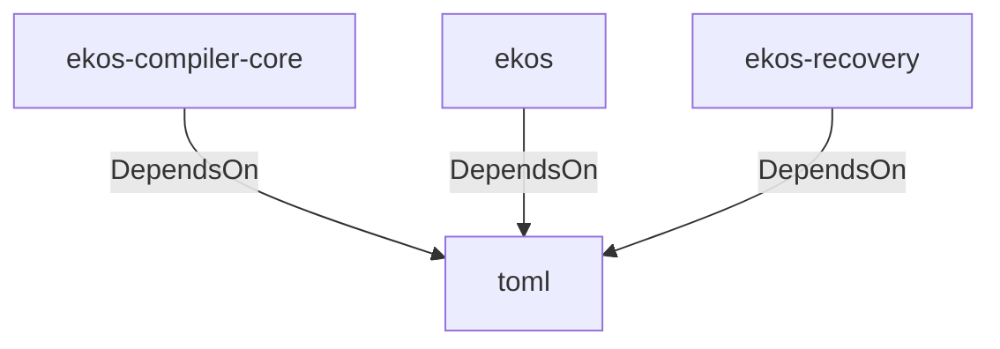

# toml (Technology)

## Properties

_No compiled properties._

## Relationships

### DependsOn

- ← ekos-compiler-core (`2690bc0d-0233-516f-b969-9e87432f623d`) — evidence: ekos-compiler-core depends on toml 0.8
- ← ekos (`abd31cd9-b31d-54c5-87cd-8a4a5b9a30a0`) — evidence: ekos depends on toml 0.8
- ← ekos-recovery (`28244ebb-4e16-5e8d-a637-5e750d01f2b8`) — evidence: ekos-recovery depends on toml 0.8

## Diagram

## Evidence

- `cb4591c1-4a07-4f8e-aae4-bdddccf5e890` — ekos-compiler-core depends on toml 0.8 (confidence: 1.00)
- `b8e85c1d-9a40-4046-a529-82ccc47f79a8` — ekos depends on toml 0.8 (confidence: 1.00)
- `e13cfe61-a3e4-4af9-b473-445e2c372d88` — ekos-recovery depends on toml 0.8 (confidence: 1.00)
