# uuid (Technology)

## Properties

_No compiled properties._

## Relationships

### DependsOn

- ← ekos-benchmark (`20c26e43-ee96-5ee7-a046-25740fbbd56b`) — evidence: ekos-benchmark depends on uuid 1
- ← ekos-semantic (`f82d9ce0-df2a-5af8-9f9a-2bd5f8484839`) — evidence: ekos-semantic depends on uuid 1
- ← ekos-kir (`7e3bc0de-d888-55cd-aa9a-f333f6e2cbb2`) — evidence: ekos-kir depends on uuid 1
- ← ekos (`abd31cd9-b31d-54c5-87cd-8a4a5b9a30a0`) — evidence: ekos depends on uuid 1
- ← ekos-artifact (`8806bf54-6364-5052-b85a-cef4344e8f19`) — evidence: ekos-artifact depends on uuid 1
- ← ekos-common (`dc169f0a-98f1-5c7c-8dd0-1dbc8504e9c9`) — evidence: ekos-common depends on uuid 1
- ← ekos-marketing (`18dba45d-9534-5035-bd6f-df6b370079ac`) — evidence: ekos-marketing depends on uuid 1
- ← ekos-recovery (`28244ebb-4e16-5e8d-a637-5e750d01f2b8`) — evidence: ekos-recovery depends on uuid 1
- ← ekos-ledger (`9c977335-c421-519c-a889-558f0487574e`) — evidence: ekos-ledger depends on uuid 1
- ← ekos-plugin-crypto (`835d6e67-5bb0-53e7-9104-338881612548`) — evidence: ekos-plugin-crypto depends on uuid 1

## Diagram

```mermaid
graph TD
    nba61f6c0d1605eafa437895cee5c72e9["uuid"]
    n20c26e43ee965ee7a04625740fbbd56b["ekos-benchmark"]
    n20c26e43ee965ee7a04625740fbbd56b -->|DependsOn| nba61f6c0d1605eafa437895cee5c72e9
    nf82d9ce0df2a5af89f9a2bd5f8484839["ekos-semantic"]
    nf82d9ce0df2a5af89f9a2bd5f8484839 -->|DependsOn| nba61f6c0d1605eafa437895cee5c72e9
    n7e3bc0ded88855cdaa9af333f6e2cbb2["ekos-kir"]
    n7e3bc0ded88855cdaa9af333f6e2cbb2 -->|DependsOn| nba61f6c0d1605eafa437895cee5c72e9
    nabd31cd9b31d54c587cd8a4a5b9a30a0["ekos"]
    nabd31cd9b31d54c587cd8a4a5b9a30a0 -->|DependsOn| nba61f6c0d1605eafa437895cee5c72e9
    n8806bf5463645052b85acef4344e8f19["ekos-artifact"]
    n8806bf5463645052b85acef4344e8f19 -->|DependsOn| nba61f6c0d1605eafa437895cee5c72e9
    ndc169f0a98f15c7c8dd01dbc8504e9c9["ekos-common"]
    ndc169f0a98f15c7c8dd01dbc8504e9c9 -->|DependsOn| nba61f6c0d1605eafa437895cee5c72e9
    n18dba45d95345035bd6fdf6b370079ac["ekos-marketing"]
    n18dba45d95345035bd6fdf6b370079ac -->|DependsOn| nba61f6c0d1605eafa437895cee5c72e9
    n28244ebb4e165e8da6375e750d01f2b8["ekos-recovery"]
    n28244ebb4e165e8da6375e750d01f2b8 -->|DependsOn| nba61f6c0d1605eafa437895cee5c72e9
    n9c977335c421519ca889558f0487574e["ekos-ledger"]
    n9c977335c421519ca889558f0487574e -->|DependsOn| nba61f6c0d1605eafa437895cee5c72e9
    n835d6e675bb053e79104338881612548["ekos-plugin-crypto"]
    n835d6e675bb053e79104338881612548 -->|DependsOn| nba61f6c0d1605eafa437895cee5c72e9
```

## Evidence

- `82a8e757-23b7-4187-9c3c-f87fa8fa0230` — ekos-benchmark depends on uuid 1 (confidence: 1.00)
- `119c9177-a2eb-40d5-bc1b-0ee1bc36593a` — ekos-semantic depends on uuid 1 (confidence: 1.00)
- `4c6545a2-9611-4d22-9cd3-a3d6d688f48d` — ekos-kir depends on uuid 1 (confidence: 1.00)
- `d546e32b-9559-4294-aaf1-dd1aa1167708` — ekos depends on uuid 1 (confidence: 1.00)
- `a550c601-c678-4f88-b80e-c067e8a723b0` — ekos-artifact depends on uuid 1 (confidence: 1.00)
- `28e032c8-71a1-4d12-ac2a-3553e2400a9a` — ekos-common depends on uuid 1 (confidence: 1.00)
- `2fd67137-88ff-4cda-a773-2a0380952361` — ekos-marketing depends on uuid 1 (confidence: 1.00)
- `0115baec-4ac9-4278-bf05-45522250d9b0` — ekos-recovery depends on uuid 1 (confidence: 1.00)
- `8e4e763f-a3cf-4941-958d-014e1f430004` — ekos-ledger depends on uuid 1 (confidence: 1.00)
- `4e680ddf-4e55-490f-b740-95f4cf282cae` — ekos-plugin-crypto depends on uuid 1 (confidence: 1.00)
