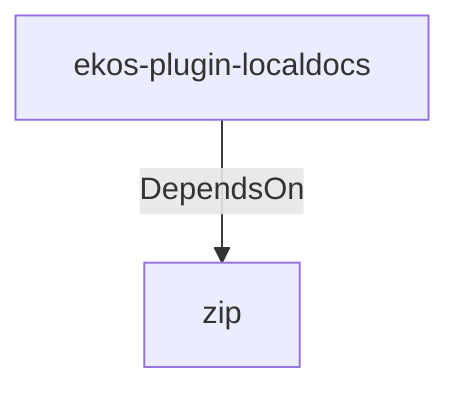

# zip (Technology)

## Properties

_No compiled properties._

## Relationships

### DependsOn

- ← ekos-plugin-localdocs (`0659fbf3-d2f4-54ba-835f-a7f6f875a7d1`) — evidence: ekos-plugin-localdocs depends on zip 2

## Diagram

## Evidence

- `14e3cba4-d5f9-4fa5-bd72-6b2a5b66ac51` — ekos-plugin-localdocs depends on zip 2 (confidence: 1.00)
