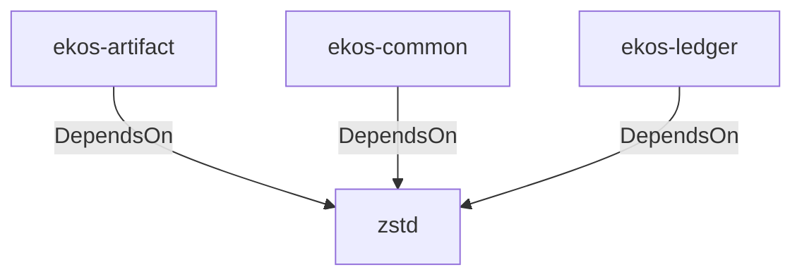

# zstd (Technology)

## Properties

_No compiled properties._

## Relationships

### DependsOn

- ← ekos-artifact (`8806bf54-6364-5052-b85a-cef4344e8f19`) — evidence: ekos-artifact depends on zstd 0.13
- ← ekos-common (`dc169f0a-98f1-5c7c-8dd0-1dbc8504e9c9`) — evidence: ekos-common depends on zstd 0.13
- ← ekos-ledger (`9c977335-c421-519c-a889-558f0487574e`) — evidence: ekos-ledger depends on zstd 0.13

## Diagram

## Evidence

- `f3b19581-6d3b-41b2-8541-e6f9b802c3a9` — ekos-artifact depends on zstd 0.13 (confidence: 1.00)
- `f262b39f-d879-44d8-9460-615bc294c9d6` — ekos-common depends on zstd 0.13 (confidence: 1.00)
- `287f056d-e9d6-405e-8c01-f8199b8fe493` — ekos-ledger depends on zstd 0.13 (confidence: 1.00)
