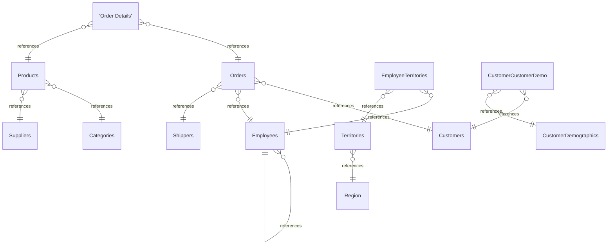

# Entity-Relationship Diagram

```mermaid
erDiagram
    "Employees" }o--|| "Employees" : references
    "Orders" }o--|| "Customers" : references
    "Orders" }o--|| "Employees" : references
    "Orders" }o--|| "Shippers" : references
    "Products" }o--|| "Categories" : references
    "Products" }o--|| "Suppliers" : references
    "'Order Details'" }o--|| "Orders" : references
    "'Order Details'" }o--|| "Products" : references
    "Territories" }o--|| "Region" : references
    "EmployeeTerritories" }o--|| "Employees" : references
    "EmployeeTerritories" }o--|| "Territories" : references
    "CustomerCustomerDemo" }o--|| "Customers" : references
    "CustomerCustomerDemo" }o--|| "CustomerDemographics" : references
```
