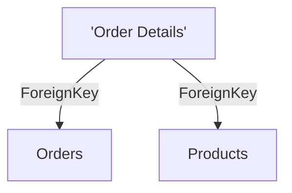

# "Order Details" (Table)

## Properties

| Key | Value |
|---|---|
| `columns` | [{"data_type":"INT","name":"OrderID"},{"data_type":"INT","name":"ProductID"},{"data_type":"DECIMAL(10,2)","name":"UnitPrice"},{"data_type":"SMALLINT","name":"Quantity"},{"data_type":"REAL","name":"Discount"}] |

## Relationships

### ForeignKey

- → Orders (`e6969c91-8b70-4a56-b73c-73a0725c919f`) — evidence: "order details".OrderID → orders.OrderID
- → Products (`72719579-f001-4e49-a262-d39d00dc2e5e`) — evidence: "order details".ProductID → products.ProductID

## Diagram

## Evidence

- `123db216-75bb-4c02-bac7-aa1f92f1b49e` — CREATE TABLE "Order Details" (confidence: 1.00)
- `6c11b1d1-a7dc-4e07-859a-d8cf56aab1c2` — "order details".OrderID → orders.OrderID (confidence: 1.00)
- `5ff10a17-f804-42b7-beeb-8dfb86b3040c` — "order details".ProductID → products.ProductID (confidence: 1.00)
