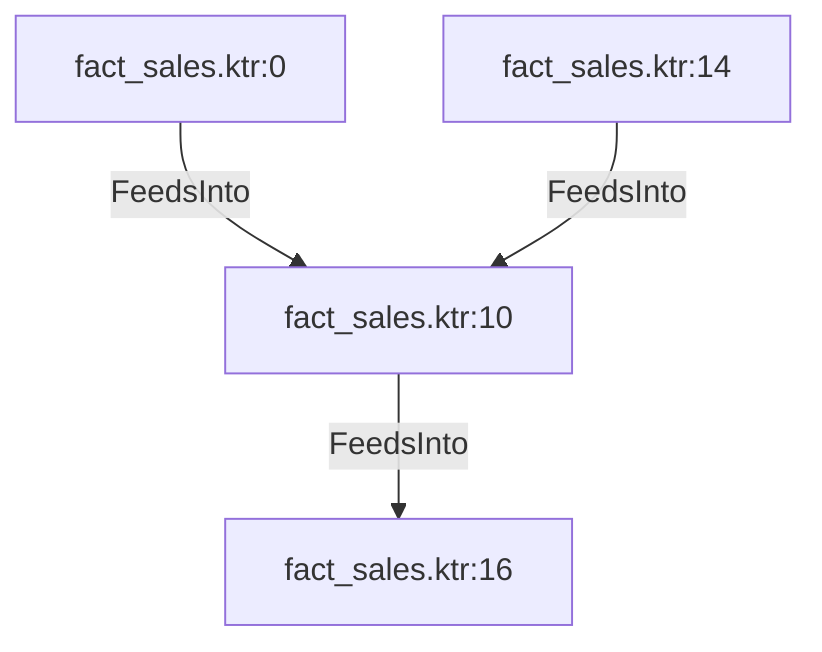

# fact_sales.ktr:10 (TransformNode)

## Properties

| Key | Value |
|---|---|
| `join_kind` | Left |
| `keys` | [] |
| `left` | 0 |
| `node_type` | Join |
| `right` | 0 |

## Relationships

### FeedsInto

- → fact_sales.ktr:16 (`2e91079f-fc19-57bc-9bc1-cf166fd9d16f`)
- ← fact_sales.ktr:0 (`bd436d40-4053-57f4-ac77-b4ffe37edae4`)
- ← fact_sales.ktr:14 (`884cc763-9ec4-56db-a54f-5f3841499a27`)

## Diagram

## Evidence

- `163d340c-89cb-5d5d-9fe5-4d4f5ab999c6` — Left JOIN ON [] (confidence: 1.00)
