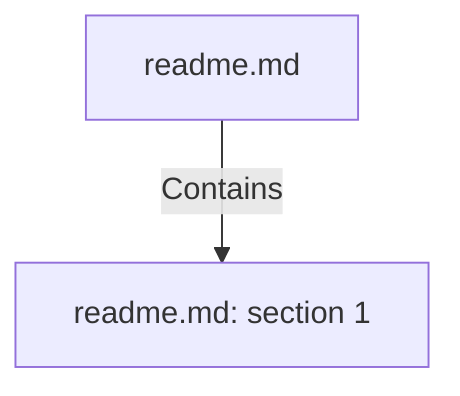

# readme.md (Document)

## Properties

| Key | Value |
|---|---|
| `doc_format` | md |
| `excerpt` | # Adventureworks_sales_purchases_datamart
This is the final assignment from the Data Management course from the Big Data &amp; Analytics Masters @ [EAE](https://www.eae.es/) class of 2021.
This project:
* Extracts data from the famous [Microsoft SQL](https://www.microsoft.com/en-us/sql-server) demo database [Adventureworks](https://docs.microsoft.com/en-us/sql/samples/adventureworks-install-configure?view=sql-server-ver15&tabs=ssms)
* Uses [Date Nager API](https://date.nager.at/) to specify holidays into the date dimension
* Uses a [simple weather csv](https://en.wikipedia.org/wiki/Season#Mete |
| `page_count` | null |
| `path` | readme.md |

## Relationships

### Contains

- → readme.md: section 1 (`c183382b-4e70-54a8-b6f0-e6ec7cdd9f53`) — evidence: section 1 extracted from readme.md

## Diagram

## Evidence

- `0881028a-2e4c-4fcc-b003-ecc7b9d75722` — local document: readme.md (md) (confidence: 1.00)
- `540b1b7e-9eee-4969-bb7d-92d3b163e661` — section 1 extracted from readme.md (confidence: 1.00)
