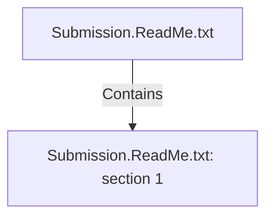

# Submission.ReadMe.txt (Document)

## Properties

| Key | Value |
|---|---|
| `doc_format` | txt |
| `excerpt` | The document "Adventureworks.Sales.Purchases.DataManagement" was made in Google Docs and explain the work of our assignment. 
We published in both formats so that our teachers review whichever is easier for them:
Adventureworks.Sales.Purchases.DataManagement.docx
Adventureworks.Sales.Purchases.DataManagement.pdf 

In that document, there's an appendix explaining the supporting technical files: *.ktr, *.kjb, *.sql
 |
| `page_count` | null |
| `path` | Submission.ReadMe.txt |

## Relationships

### Contains

- → Submission.ReadMe.txt: section 1 (`1c235327-b6ce-5c98-ac4a-9f6d0ec47021`) — evidence: section 1 extracted from Submission.ReadMe.txt

## Diagram

## Evidence

- `86c48243-43a1-4c39-b10a-4dcc726d40a7` — local document: Submission.ReadMe.txt (txt) (confidence: 1.00)
- `9ee4a42e-8bc2-4c39-9899-53fceba05c5a` — section 1 extracted from Submission.ReadMe.txt (confidence: 1.00)
