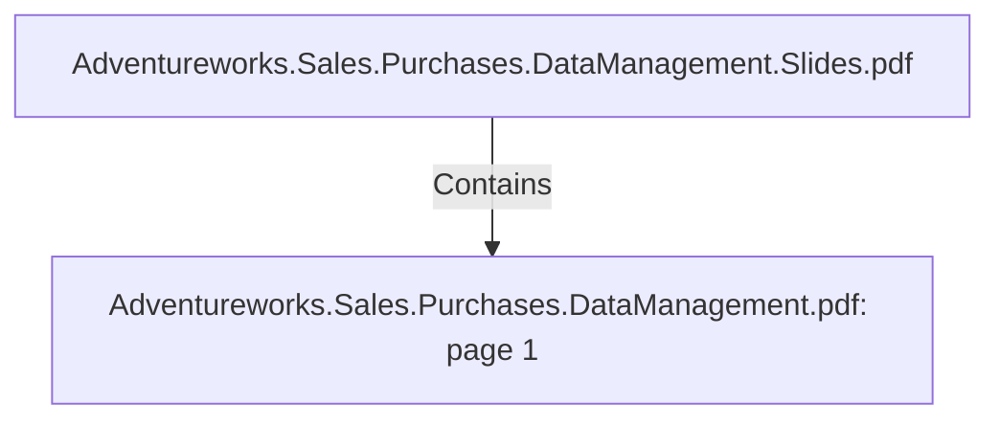

# Adventureworks.Sales.Purchases.DataManagement.pdf: page 1 (Section)

## Properties

| Key | Value |
|---|---|
| `excerpt` | 

 
 
 ANALYTICS  FOR 
ADVENTUREWORKS 

 
 
 
 
 

 
PREPARED  FOR 

EAE  Data  Management  2 0 2 0  

Francesc  Casado 

Bruno  Garcia   

PREPARED  BY 

Adrian  Hagen 

Jon  Dale 

Mohamed  Ashmawy 

Mostafa  AbdElKhalek 

Josep h  Higaki 

 Table  of  Contents 

Project  Overview 5  

Business  Challenges 5  

Technical  Architecture 6  

  |
| `page` | 1 |
| `section_index` | 0 |

## Relationships

### Contains

- ← Adventureworks.Sales.Purchases.DataManagement.Slides.pdf (`f240004c-ab01-5ee9-a371-83bdd1c54d35`) — evidence: section 1 (page 1) extracted from Adventureworks.Sales.Purchases.DataManagement.pdf

## Diagram

## Evidence

- `bbe0d28e-d22f-4977-bca5-d9505d4b70a5` — section 1 (page 1) extracted from Adventureworks.Sales.Purchases.DataManagement.pdf (confidence: 1.00)
