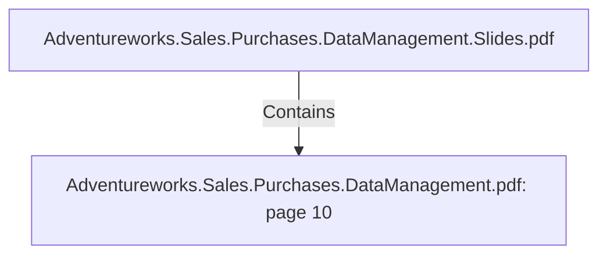

# Adventureworks.Sales.Purchases.DataManagement.pdf: page 10 (Section)

## Properties

| Key | Value |
|---|---|
| `excerpt` | 

 
 
 
 
 fin ished_ go o ds_ fla
g  No   BOOLE
AN 
 0  = Pro duct is n o t a  
sa la b le item. 1  = 
Pro duct is sa la b le. 
Defa ult: 1  
 Extracted from 
AdventureWorks2 0 1 9  table 
Production.Product column 
FinishedGoodsFlag 

co lo r  No   VARCH
AR  Co lo r o f p ro duct 
 Extracted from 
AdventureWorks2 0 1 9  table 
Production.Product column 
Color 

siz e  No   VARCH
AR  Siz e o f p ro duct 
 Extracted from 
AdventureWorks2 0 1 9  table 
Production.Product column 
Size 

siz e_ un it_ mea sure
_ co de  No   VARCH
AR  Siz e un it mea sure co de 
o f the p ro duct 
 Extracted from 
AdventureWorks2 0 1 9  table 
Production.Product column 
SizeUnitMeasureCode 

siz e_ un it_ mea sure
_ n a me  No   VARCH
AR  Siz e un it mea sure 
n a me 
 Extracted from 
AdventureWorks2 0 1 9  table 
Production.UnitMeasure 
column Name 

weight  No   VARCH
AR  Weight o f the p ro duct 
 Extracted from 
AdventureWorks2 0 1 9  table 
Production.Product column 
Weight 

weight_ un it_ mea s
ure_ co de  No   VARCH
AR  Weight un it mea sure 
co de 
 Extracted from 
AdventureWorks2 0 1 9  table 
Production.Product column 
WeightUnitMeasureCode 

weight_ un it_ mea s
ure_ n a me  No   VARCH
AR   |
| `page` | 10 |
| `section_index` | 9 |

## Relationships

### Contains

- ← Adventureworks.Sales.Purchases.DataManagement.Slides.pdf (`f240004c-ab01-5ee9-a371-83bdd1c54d35`) — evidence: section 10 (page 10) extracted from Adventureworks.Sales.Purchases.DataManagement.pdf

## Diagram

## Evidence

- `8cce0354-c691-491c-b5d5-25df93bc95d9` — section 10 (page 10) extracted from Adventureworks.Sales.Purchases.DataManagement.pdf (confidence: 1.00)
