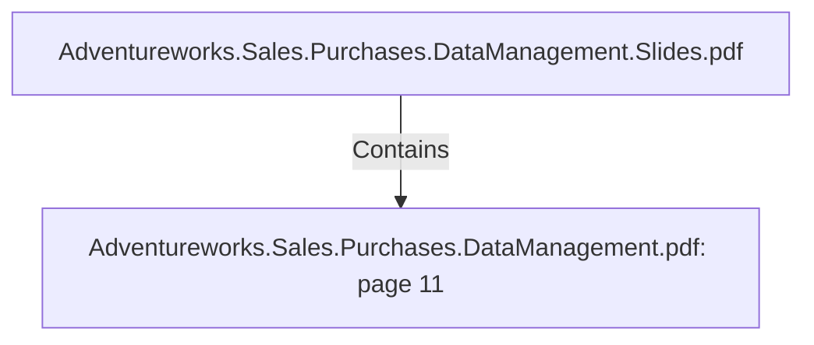

# Adventureworks.Sales.Purchases.DataManagement.pdf: page 11 (Section)

## Properties

| Key | Value |
|---|---|
| `excerpt` | 

 
 
 
 
 Production.Product column 
Class 

cla ss_ descrip tio n   No   VARCH
AR  Cla ss descrip tio n   Extracted from 
AdventureWorks2 0 1 9  table 

sty le  No   VARCH
AR  W = Wo men s, M = 
Men s, U = Un iversa l  Extracted from 
AdventureWorks2 0 1 9  table 

sty le_ descrip tio n   No   VARCH
AR  Sty le descrip tio n   Extracted from 
AdventureWorks2 0 1 9  table 

p ro dut_ sub ca tego r
y _ id  No   INTEG
ER 
 Sub ca tego ry  ID, ea ch 
p ro duct is divided in  
sub ca tego ries 
 Extracted from 
AdventureWorks2 0 1 9  table 
Production.ProductSubcategory 
column ProductSubcategoryID 

p ro duct_ sub ca teg
o ry _ n a me  No   VARCH
AR  Na me o f the 
sub ca tego ry  
 Extracted from 
AdventureWorks2 0 1 9  table 
Production.ProductSubcategory 
column Name 

p ro duct_ ca tego ry _
id  No   INTEG
ER  Pro duct ca tego ry  ID 
 Extracted from 
AdventureWorks2 0 1 9  table 
Production.ProductCategory 
column ProductCategoryID 

p ro duct_ ca tego ry _
n a me  No   VARCH
AR  Na me o f the p ro duct 
ca teo gry  
 Extracted from 
AdventureWorks2 0 1 9  table 
Production.ProductCategory 
column Name 

p ro duct_ mo del_ id  No   INTEG
ER  Pro duct mo del id 
 Extracted from 
A |
| `page` | 11 |
| `section_index` | 10 |

## Relationships

### Contains

- ← Adventureworks.Sales.Purchases.DataManagement.Slides.pdf (`f240004c-ab01-5ee9-a371-83bdd1c54d35`) — evidence: section 11 (page 11) extracted from Adventureworks.Sales.Purchases.DataManagement.pdf

## Diagram

## Evidence

- `a8b80b3f-ffbc-46e8-9e50-3cb003b3b855` — section 11 (page 11) extracted from Adventureworks.Sales.Purchases.DataManagement.pdf (confidence: 1.00)
