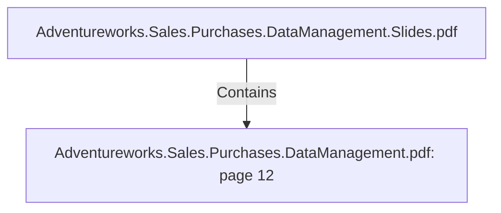

# Adventureworks.Sales.Purchases.DataManagement.pdf: page 12 (Section)

## Properties

| Key | Value |
|---|---|
| `excerpt` | 

 
 
 
 
Product  Transformation 

 
  

The  Product  transformation  de-normalizes  Product  Subcategory  Category  and  Model  by 
doing  lookup s.    

We  are  using  a  Dimension  lookup /up date  comp onent  in  Kettle  to  imp lement  the  Slowly 
Changing  Dimension  typ e  2   behaviour.   This  allows  changes  in  the  source  system  to  be 
traced,   where  a  new  dimension  row  will  be  added  for  the  changed  record.   This  allows  us 
to  have  the  full  history  of  values.   When  a  value  of  an  attribute  changes,   the  current  record 
will  be  closed.   The  new  record  with  the  changed  data  will  become  the  current  record.   Each 
record  will  have  a  start-  and  end  date  allowing  the  user  to  identify  the  time  p eriods  the 
records  are  active  or  closed.      

 
 dimen sio n  first lo a d 

Kettle  transformation  dim_p roduct. ktr  |
| `page` | 12 |
| `section_index` | 11 |

## Relationships

### Contains

- ← Adventureworks.Sales.Purchases.DataManagement.Slides.pdf (`f240004c-ab01-5ee9-a371-83bdd1c54d35`) — evidence: section 12 (page 12) extracted from Adventureworks.Sales.Purchases.DataManagement.pdf

## Diagram

## Evidence

- `7698cbd4-8b8c-4454-a821-bbf7968b2994` — section 12 (page 12) extracted from Adventureworks.Sales.Purchases.DataManagement.pdf (confidence: 1.00)
