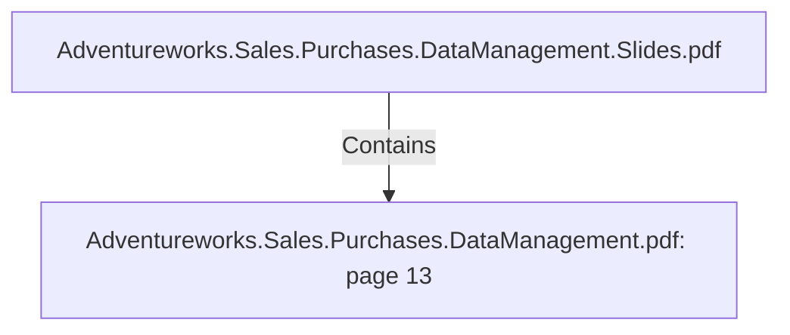

# Adventureworks.Sales.Purchases.DataManagement.pdf: page 13 (Section)

## Properties

| Key | Value |
|---|---|
| `excerpt` | 

 
 
 
 6. Customer 

Customer  Dimension   

The  customer  dimension  has  been  de-normalized  to  contain  information  about  individual 
customers  and  resellers  in  one  table.   The  p urp ose  of  the  table  is  to  be  able  to  filter  facts 
such  as  sales  on  individual  customers  and  resellers,   or  categorize  sales  to  one  of  these  two 
group s.   This  dimension  allows  us  to  answer  business  challenge  1 :   Analyze  reseller  sales 
vs  direct  consumer  sales  over  sp ecific  holidays.    

Customer  Dimension  is  a  slowly  changing  dimension  typ e  2 .   Its  history  is  kep t  by 
versioning  each  row  and  assigning  an  effective  date  range  by  the  ETL  p rocess.  

 
Customer  Data  Dictionary 

 

 
 Table  Name  dim_customer 

C o l umn  N a me   K e y?  Typ e   D e sc ri p ti o n   So urc e  

dim_customer
_id  Yes  INTEG
ER  Surrogate key  Gen era ted in  a  sta gin g da ta b a se usin g 
a uto in cremen t 

customer_id  No   INTEG
ER 
 This is the 
customer primary 
key in the 
transactional 
database 
 Ex tra cted fro m Adven tureWo rks2 0 1 9  
ta b le Sa les.Custo mer 

is_reseller  No   BOOL
EAN 
 Flag indicating if it 
 |
| `page` | 13 |
| `section_index` | 12 |

## Relationships

### Contains

- ← Adventureworks.Sales.Purchases.DataManagement.Slides.pdf (`f240004c-ab01-5ee9-a371-83bdd1c54d35`) — evidence: section 13 (page 13) extracted from Adventureworks.Sales.Purchases.DataManagement.pdf

## Diagram

## Evidence

- `8add9e02-9831-4ac0-ac0a-3467e7f1885a` — section 13 (page 13) extracted from Adventureworks.Sales.Purchases.DataManagement.pdf (confidence: 1.00)
