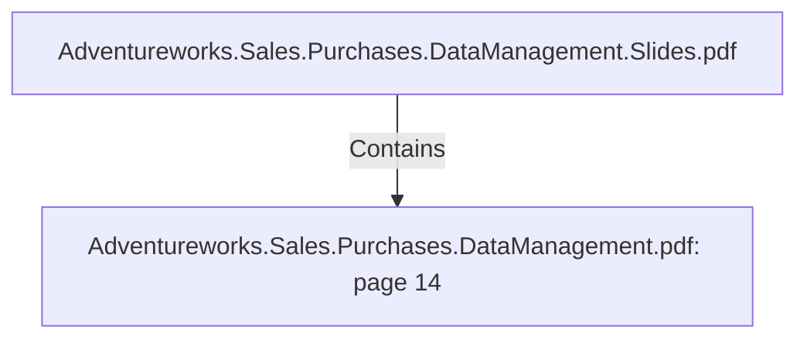

# Adventureworks.Sales.Purchases.DataManagement.pdf: page 14 (Section)

## Properties

| Key | Value |
|---|---|
| `excerpt` | 

 
 
 
 

 
 
Customer  Transformation 

 
  

 
 _name  HAR  ta b le Sa les.Sto re a n d co lumn  Na me 

person_title  No   VARC
HAR  Title of person  Ex tra cted fro m Adven tureWo rks2 0 1 9  
ta b le Perso n .Perso n  a n d co lumn  Title 

person_first_n
ame  No   VARC
HAR  First name of 
person 
 Ex tra cted fro m Adven tureWo rks2 0 1 9  
ta b le Perso n .Perso n  a n d co lumn  
FirstNa me 

person_middle
_name  No   VARC
HAR  Middle name of 
person 
 Ex tra cted fro m Adven tureWo rks2 0 1 9  
ta b le Perso n .Perso n  a n d co lumn  
MiddleNa me 

person_last_n
ame  No   VARC
HAR  Last name of 
person 
 Ex tra cted fro m Adven tureWo rks2 0 1 9  
ta b le Perso n .Perso n  a n d co lumn  
La stNa me 

person_suffix  No   VARC
HAR  Suffix of person  Ex tra cted fro m Adven tureWo rks2 0 1 9  
ta b le Perso n .Perso n  a n d co lumn  Suffix  

versio n _ n umb er  No   INTEG
ER  Versio n  n umb er o f 
the reco rd  Gen era ted if we n eed to  in sert a  n ew 
reco rd in to  the da ta b a se 

sta rt_ da te  No   DATE
TIME  Sta rt da te o f va lidity  
o f reco rd  Gen era ted if we n eed to  in sert a  n ew 
reco rd in to  the da ta b a se 

en d_ da te  No   DATE
TIME  En |
| `page` | 14 |
| `section_index` | 13 |

## Relationships

### Contains

- ← Adventureworks.Sales.Purchases.DataManagement.Slides.pdf (`f240004c-ab01-5ee9-a371-83bdd1c54d35`) — evidence: section 14 (page 14) extracted from Adventureworks.Sales.Purchases.DataManagement.pdf

## Diagram

## Evidence

- `ccf04dd5-ee0e-4b47-88d1-d9c3ad2cd8b0` — section 14 (page 14) extracted from Adventureworks.Sales.Purchases.DataManagement.pdf (confidence: 1.00)
