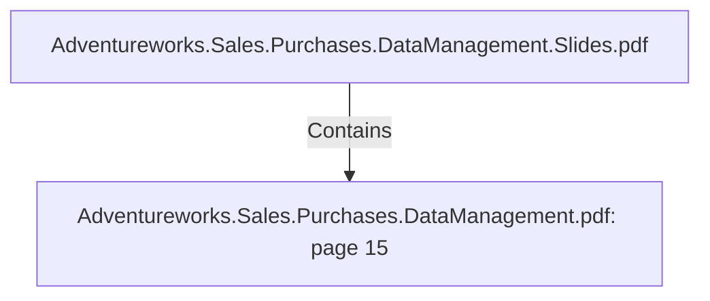

# Adventureworks.Sales.Purchases.DataManagement.pdf: page 15 (Section)

## Properties

| Key | Value |
|---|---|
| `excerpt` | 

 
 
 
 
Information  about  customers  and  resellers  are  acq uired  from  the  p erson. p erson  table  and 
sales. store  table  in  the  transactional  database.   To  get  the  name  of  the  reseller  the  business 
entityid  was  needed  and  was  retrieved  from  the  salesp erson  table  in  the  transactional 
database  by  using  territoryid.   To  be  able  to  filter  between  reseller  and  individual 
customers  a  dummy  for  resellers  was  created  using  a  java  scrip t.   This  scrip t  creates  a 
dummy  value  eq ual  to  one  if  the  resellerid  is  not  null,   and  zero  if  it  is  null.   A  add  seq uence 
function  was  added  to  create  the  surrogate  key.  

We  used  a  Dimension  lookup /up date  comp onent  in  Kettle  to  imp lement  the  Slowly 
Changing  Dimension  typ e  2   behaviour.  

   

  |
| `page` | 15 |
| `section_index` | 14 |

## Relationships

### Contains

- ← Adventureworks.Sales.Purchases.DataManagement.Slides.pdf (`f240004c-ab01-5ee9-a371-83bdd1c54d35`) — evidence: section 15 (page 15) extracted from Adventureworks.Sales.Purchases.DataManagement.pdf

## Diagram

## Evidence

- `b6c797b5-72c9-4850-8952-c7826d8c9093` — section 15 (page 15) extracted from Adventureworks.Sales.Purchases.DataManagement.pdf (confidence: 1.00)
