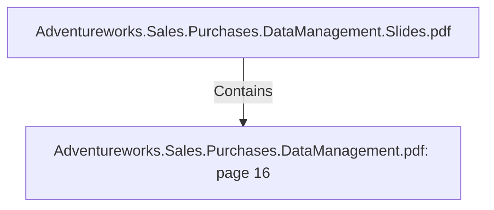

# Adventureworks.Sales.Purchases.DataManagement.pdf: page 16 (Section)

## Properties

| Key | Value |
|---|---|
| `excerpt` | 

 
 
 
 7. Sales  Person 

Sales  Person  Dimension   

The  sales  dimension  has  been  de-normalized  to  contain  all  the  info  about  the  sales 
emp loyees  that  can  be  used  to  identify  the  emp loyees  role  and  identity.   This  dimension 
does  not  resolve  one  of  the  p resented  business  challenges,   but  it  is  likely  to  be  useful  in 
the  future.   For  examp le,   it  allows  the  end-users  to  see  which  sales  p ersons  are  the  top  
p erforming  measured  by  sales.    

 
Sales  Person  Data  Dictionary 

 

 
 Table  Name  dim_sales_p erson 

C o l umn  N a me   K e y?  Typ e   D e sc ri p ti o n   So urc e  

dim_ sa les_ p ers
o n _ id  Yes  In tege
r  Surro ga te key   Gen era ted in  the my Sq l DB usin g the a dd 
seq uen ce fea ture in  kettle 

sa les_ p erso n _ e
n tity _ id  No   In tege
r 
 A un iq ue ID tha t 
iden tify  the Sa les 
emp lo y ees  Adven tureWo rks Sa lesPerso n  ta b le 

p erso n _ title  No   Strin g  Sa les Emp lo y ee 
Title  Adven tureWo rks Perso n  ta b le Jo in ed with 
Sa lesPerso n  ta b le usin g Busin essEn tity ID 

p erso n _ first_ n a
me  No   Strin g  Sa les Emp lo y ee 
FirstNa me  Adven tureWo |
| `page` | 16 |
| `section_index` | 15 |

## Relationships

### Contains

- ← Adventureworks.Sales.Purchases.DataManagement.Slides.pdf (`f240004c-ab01-5ee9-a371-83bdd1c54d35`) — evidence: section 16 (page 16) extracted from Adventureworks.Sales.Purchases.DataManagement.pdf

## Diagram

## Evidence

- `176417cd-ec15-4fcc-bb10-8081bbe1dead` — section 16 (page 16) extracted from Adventureworks.Sales.Purchases.DataManagement.pdf (confidence: 1.00)
