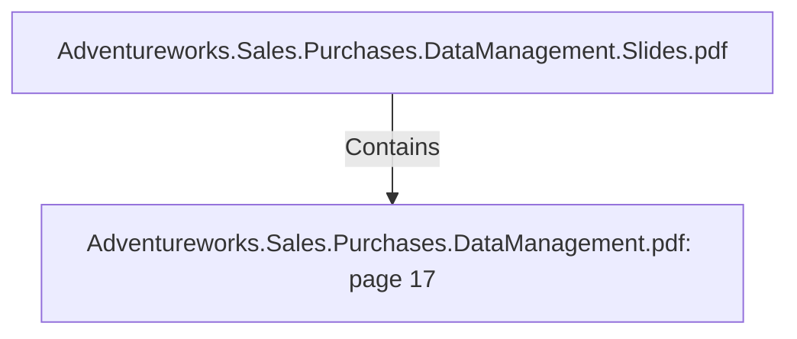

# Adventureworks.Sales.Purchases.DataManagement.pdf: page 17 (Section)

## Properties

| Key | Value |
|---|---|
| `excerpt` | 

 
 
 
 
Sales  Person  Transformation 

 
  

The  SalesPerson  transformation  de-normalizes  table  p erson  and  table  HrEmp loyee  by 
doing  lookup s.    

An  add  seq uence  function  was  added  to  create  the  surrogate  key  and  the  select  values 
function  to  map   the  data  to  the  right  columns  in  the  MySq l  database.      

 
 emp lo y ee_ ma rit
a l_ sta tus  No   Cha r  Sa les Emp lo y ee 
Ma rtia lSta tus  Adven tureWo rks Perso n  ta b le Jo in ed with 
Emp lo y ee ta b le usin g Busin essEn tity ID 

emp lo y ee_ n a tio
n a l_ id_ n umb er  No   In tege
r  Sa les Emp lo y ee 
Na tio n a lIDNumb er  Adven tureWo rks Perso n  ta b le Jo in ed with 
Emp lo y ee ta b le usin g Busin essEn tity ID 

Kettle  transformation  dim_sales_p erson. ktr  |
| `page` | 17 |
| `section_index` | 16 |

## Relationships

### Contains

- ← Adventureworks.Sales.Purchases.DataManagement.Slides.pdf (`f240004c-ab01-5ee9-a371-83bdd1c54d35`) — evidence: section 17 (page 17) extracted from Adventureworks.Sales.Purchases.DataManagement.pdf

## Diagram

## Evidence

- `1f635be8-442e-4235-bc28-f41a641f3386` — section 17 (page 17) extracted from Adventureworks.Sales.Purchases.DataManagement.pdf (confidence: 1.00)
