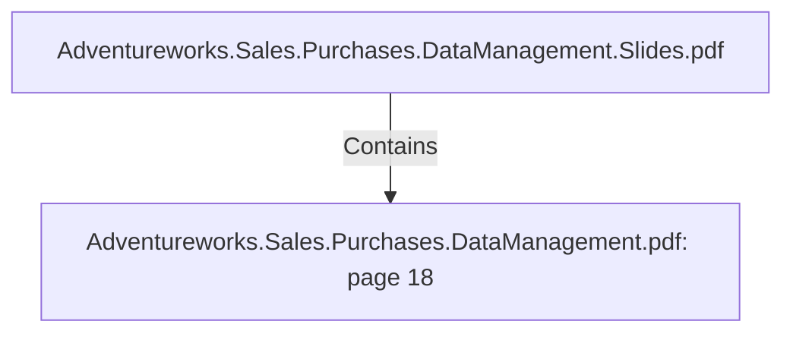

# Adventureworks.Sales.Purchases.DataManagement.pdf: page 18 (Section)

## Properties

| Key | Value |
|---|---|
| `excerpt` | 

 
 
 
 8. Sales  Territory 

Sales  Territory  Dimension   

This  dimension  is  resp onsible  for  collecting  and  rep resenting  the  data  about  the  sales 
territory,   starting  with  the  territory’s  geograp hic  location  and  uniq ue  ID  to  the  territory’s 
name.   This  dimension  is  not  related  to  a  sp ecific  business  challenge  either,   but  could  also 
be  useful  in  the  future.   It  allows  the  end  users  to  answer  q uestions  such  as  which  sales 
territory  have  the  highest  sales  or  q uantity  sold.    

 
Sales  Territory  Data  Dictionary 

 
 

 
 Table  Name  dim_sales_territory 

Co lumn  Na me  Key ?  Ty p e  Descrip tio n   So urce 

Sa les_ Territo ry _
ID  Yes  In tege
r  Surro ga te Key   Gen era ted in  the my Sq l DB usin g the 
a dd seq uen ce fea ture in  Kettle 

territo ry _ ID  No   In tege
r  Un iq ue ID fo r every  
sa les territo ry   Adven turewo rks sa les territo ry  ta b le 

Sa les_ Territo ry _
Na me  No   Va rch
a r 
 Na me o f ea ch 
sp ecific sa les 
territo ry   Adven turewo rks sa les territo ry  ta b le 

Co un try _ Regio n
_ Co de  No   Va rch
a r 
 An  a b b revia tio n  
co de to  the regio n  
where |
| `page` | 18 |
| `section_index` | 17 |

## Relationships

### Contains

- ← Adventureworks.Sales.Purchases.DataManagement.Slides.pdf (`f240004c-ab01-5ee9-a371-83bdd1c54d35`) — evidence: section 18 (page 18) extracted from Adventureworks.Sales.Purchases.DataManagement.pdf

## Diagram

## Evidence

- `c17a323a-349c-49cd-9cc5-5dfa0e4bc580` — section 18 (page 18) extracted from Adventureworks.Sales.Purchases.DataManagement.pdf (confidence: 1.00)
