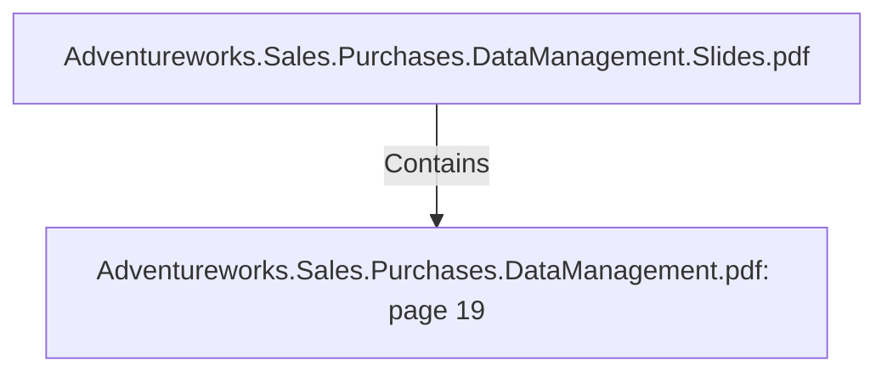

# Adventureworks.Sales.Purchases.DataManagement.pdf: page 19 (Section)

## Properties

| Key | Value |
|---|---|
| `excerpt` | 

 
 
 
Sales  Territory  Transformation 

 
  

We  used  the  “add  seq uence”  to  have  an  automated  adding  to  seq uence  of  the  uniq ue  ID.  
Then  we  filtered  the  data  we  need  with  the  select  values  to  get  the  desired  result  “clean 
data”.  

   

 
 Kettle  transformation  dim_sales_territory. ktr  |
| `page` | 19 |
| `section_index` | 18 |

## Relationships

### Contains

- ← Adventureworks.Sales.Purchases.DataManagement.Slides.pdf (`f240004c-ab01-5ee9-a371-83bdd1c54d35`) — evidence: section 19 (page 19) extracted from Adventureworks.Sales.Purchases.DataManagement.pdf

## Diagram

## Evidence

- `59515b74-76c5-4946-b4d8-b6295d08b127` — section 19 (page 19) extracted from Adventureworks.Sales.Purchases.DataManagement.pdf (confidence: 1.00)
