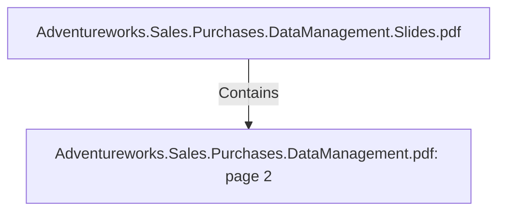

# Adventureworks.Sales.Purchases.DataManagement.pdf: page 2 (Section)

## Properties

| Key | Value |
|---|---|
| `excerpt` | 

 
 
 
Business  Entities  for  Analytical  Model 7  

Product 9  

Product  Dimension 9  

Product  Data  Dictionary 9  

Product  Transformation 1 2  

Customer 1 3  

Customer  Dimension 1 3  

Customer  Data  Dictionary 1 3  

Customer  Transformation 1 4  

Sales  Person 1 6  

Sales  Person  Dimension 1 6  

Sales  Person  Data  Dictionary 1 6  

Sales  Person  Transformation 1 7  

Sales  Territory 1 8  

Sales  Territory  Dimension 1 8  

Sales  Territory  Data  Dictionary 1 8  

Sales  Territory  Transformation 1 9  

Vendor 2 0  

Vendor  Dimension 2 0  

Vendor  Data  Dictionary 2 0  

Vendor  Transformation 2 1  

Date 2 2  

Date  Dimension 2 2  

Date  Data  Dictionary 2 2  

Date  Transformation 2 4  

Sales 2 7  

Sales  Fact 2 7  

Sales  Data  Dictionary 2 7  

Sales  Transformation 2 8  

Purchases 3 1  

Purchases  Fact 3 1  

PurchasesData  Dictionary 3 1  

Purchases  Transformation 3 2  

Job  Scheduling 3 3  

  |
| `page` | 2 |
| `section_index` | 1 |

## Relationships

### Contains

- ← Adventureworks.Sales.Purchases.DataManagement.Slides.pdf (`f240004c-ab01-5ee9-a371-83bdd1c54d35`) — evidence: section 2 (page 2) extracted from Adventureworks.Sales.Purchases.DataManagement.pdf

## Diagram

## Evidence

- `48a330dc-ca67-4758-854f-e296b204e2e4` — section 2 (page 2) extracted from Adventureworks.Sales.Purchases.DataManagement.pdf (confidence: 1.00)
