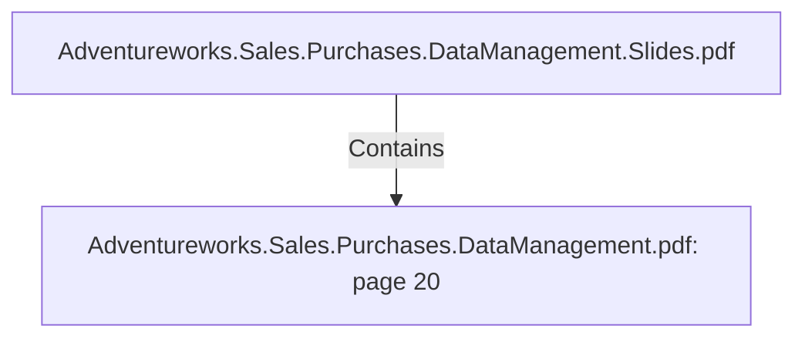

# Adventureworks.Sales.Purchases.DataManagement.pdf: page 20 (Section)

## Properties

| Key | Value |
|---|---|
| `excerpt` | 

 
 
 
 9. Vendor   

Vendor  Dimension   

This  dimension  contains  data  about  the  vendors,   and  it’s  history  is  tracked  using  slow 
changing  dimension  typ e  2 .   This  dimension  allows  us  to  answer  business  case  4 ,   where 
we  wish  to  know  the  top   5   vendors  in  terms  of  rejected  items  on  p urchased  orders.    

Vendor  Data  Dictionary 

 

 
 Table  Name  dim_vendor 

C o l umn  N a me   K e y?  Typ e   D e sc ri p ti o n   So urc e  

dim_ ven do r_ id  Yes  In tege
r  Surro ga te key   Gen era ted b y  "a dd seq uen ce" in  Kettle 
if we n eed to  in sert a  n ew reco rd in to  
the da ta b a se 

ven do r_ id  No   In tege
r  ID o f ven do r  Ex tra cted fro m Adven tureWo rks ven do r 
ta b le usin g Busin essEn tity ID 

a cco un t_ n umb e
r  No   Va rch
a r  Ven do r's a cco un t 
n umb er  Ex tra cted fro m Adven tureWo rks ven do r 
ta b le usin g Acco un tNumb er 

n a me  No   Va rch
a r  Na me o f co mp a n y   Ex tra cted fro m Adven tureWo rks ven do r 
ta b le usin g Na me 

credit_ ra tin g_ id  No   In tege
r 
 Credit ra tin g: 1  = 
sup erio r, 2  = 
ex cellen t, 3  = a b o ve 
a vera ge, 4  = 
a vera ge, 5  = b elo w 
a |
| `page` | 20 |
| `section_index` | 19 |

## Relationships

### Contains

- ← Adventureworks.Sales.Purchases.DataManagement.Slides.pdf (`f240004c-ab01-5ee9-a371-83bdd1c54d35`) — evidence: section 20 (page 20) extracted from Adventureworks.Sales.Purchases.DataManagement.pdf

## Diagram

## Evidence

- `1e35bb4b-160e-4a2a-abc4-8f9a0dfff6a4` — section 20 (page 20) extracted from Adventureworks.Sales.Purchases.DataManagement.pdf (confidence: 1.00)
