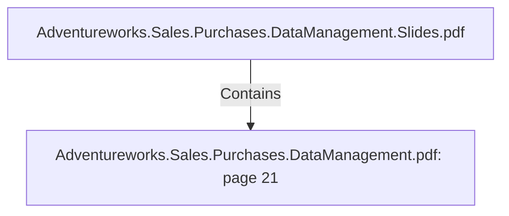

# Adventureworks.Sales.Purchases.DataManagement.pdf: page 21 (Section)

## Properties

| Key | Value |
|---|---|
| `excerpt` | 

 
 
 
Vendor  Transformation 

 
  

This  transformation  features  slow  changing  dimension  typ e  2 ,   where  we  have  a  start  date 
and  end  date  of  the  validity  of  the  records,   and  a  version  number  that  tells  us  what  version 
of  the  record  it  is.  

The  slow  changing  dimension  is  handled  by  the  dimension  lookup /up date  step   in  Kettle.  
This  uses  the  surrogate  key  «dim_vendor_id»  which  is  the  p rimary  key  of  the  dimension.  
When  a  new  version  of  the  record  is  being  inserted,   the  version  number  is  incremented  by 
1 ,   and  the  start  date  of  the  p revious  record  is  set  to  the  start  date  of  the  new  record  to  be 
inserted.   This  way,   the  old  record  has  been  invalidated,   because  it  is  not  the  latest  version.  

 
 
   

 
 Kettle  transformation  dim_vendor. ktr  |
| `page` | 21 |
| `section_index` | 20 |

## Relationships

### Contains

- ← Adventureworks.Sales.Purchases.DataManagement.Slides.pdf (`f240004c-ab01-5ee9-a371-83bdd1c54d35`) — evidence: section 21 (page 21) extracted from Adventureworks.Sales.Purchases.DataManagement.pdf

## Diagram

## Evidence

- `f7bbda54-b9ce-4e6e-9022-1a84e2cb0c6b` — section 21 (page 21) extracted from Adventureworks.Sales.Purchases.DataManagement.pdf (confidence: 1.00)
