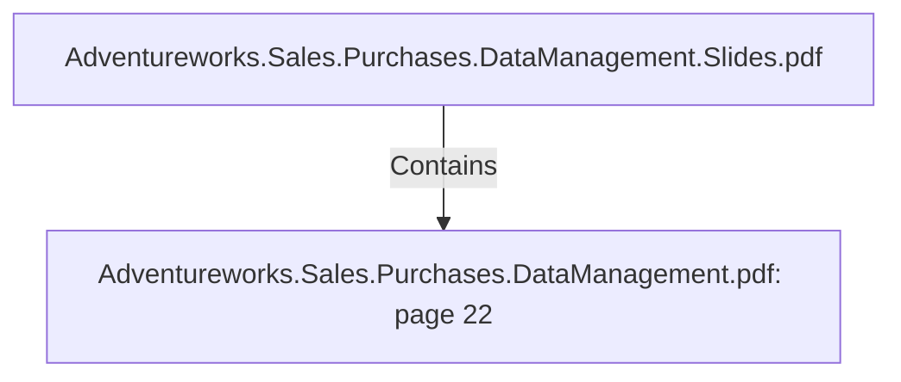

# Adventureworks.Sales.Purchases.DataManagement.pdf: page 22 (Section)

## Properties

| Key | Value |
|---|---|
| `excerpt` | 

 
 
 
 10. Date 

Date  Dimension   

In  the  date  dimension  each  record  rep resents  a  single  day  so  that  analytics  can  be  run  as 
effectively  as  p ossible.   The  date  dimension  will  hold  information  to  whether  it  is  a  Sp anish 
holiday  or  not,   and  which  holiday  name  is.  

Additionally,   the  date  dimension  contains  useful  values  such  as  the  seq uential  day  of  the 
year,   the  week  number,   q uarter  and  northern  and  southern  season.  

The  date  dimension  is  relevant  to  answer  business  challenges  1 -3 ,   and  in  general  is  very 
imp ortant  to  allow  an  historical  overview  of  the  q uantitative  data  in  our  fact  tables.  

Date  Data  Dictionary 

 

 
 Table  Name  dim_date 

C o l umn  N a me   K e y?  Typ e   D e sc ri p ti o n   So urc e  

dim_ da te_ id  Yes  In teger 
 This is the surro ga te key

It is a n  in teger with the 
fo llo win g fo rma t: 

2 0 2 0 1 2 1 4  
 Gen era ted in  a  sta gin g da ta b a se
tha t lists da y s in  a  da ta ra n ge 

YEAR * 1 0 ,0 0 0  + MONTH * 1 0 0  
DAY 

is_ ho lida y   No   In teger  Fla g in dica tin g if it is a  
ho lida y  o r n o t 
 Ho lida y  da ta |
| `page` | 22 |
| `section_index` | 21 |

## Relationships

### Contains

- ← Adventureworks.Sales.Purchases.DataManagement.Slides.pdf (`f240004c-ab01-5ee9-a371-83bdd1c54d35`) — evidence: section 22 (page 22) extracted from Adventureworks.Sales.Purchases.DataManagement.pdf

## Diagram

## Evidence

- `5a4e9b74-d6fe-415b-8da0-11e56001c5e1` — section 22 (page 22) extracted from Adventureworks.Sales.Purchases.DataManagement.pdf (confidence: 1.00)
