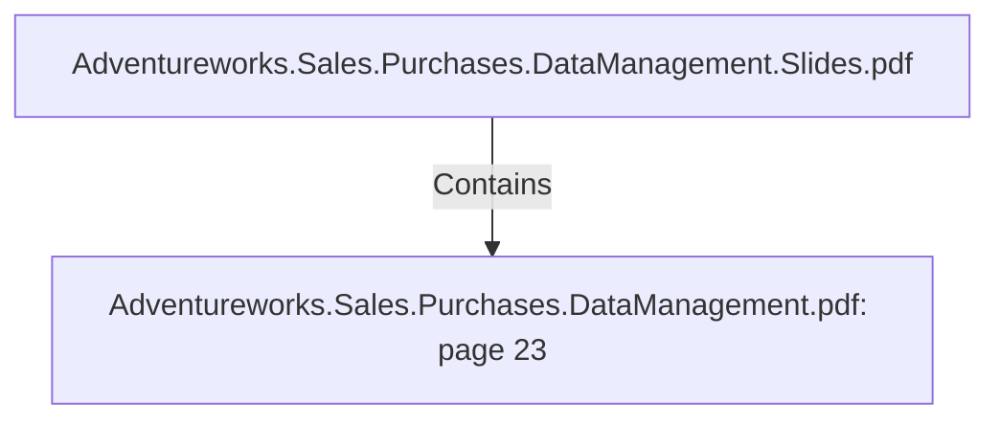

# Adventureworks.Sales.Purchases.DataManagement.pdf: page 23 (Section)

## Properties

| Key | Value |
|---|---|
| `excerpt` | 

 
 
 
 
 da te  No   Da te  Rep resen ts the da y  o f th
ro w, in  a  da te da ta b a se  Gen era ted in  a  sta gin g da ta b a se
tha t lists da y s in  a  da ta ra n ge 

da y _ o f_ the_ week_ n
b er  No   in teger  Week n umb er (0 0  to  5 3 ) Gen era ted in  a  sta gin g da ta b a se
tha t lists da y s in  a  da ta ra n ge 

da y _ o f_ the_ week_ t No   VARCHA
Week en glish tex t. e.g. 
Mo n da y , Tuesda y   Gen era ted in  a  sta gin g da ta b a se
tha t lists da y s in  a  da ta ra n ge 

da y _ o f_ the_ mo n th_
b er  No   in teger  Da y  o f the mo n th a s a  
n umeric va lue (0 1  to  3 1 ) Gen era ted in  a  sta gin g da ta b a se
tha t lists da y s in  a  da ta ra n ge 

da y _ o f_ the_ mo n th_ No   VARCHA
Da y  o f the mo n th tex t. e
1 st, 2 n d  Gen era ted in  a  sta gin g da ta b a se
tha t lists da y s in  a  da ta ra n ge 

mo n th_ n umb er  No   in teger  Da y  o f the mo n th n umb e
to  3 1 )  Gen era ted in  a  sta gin g da ta b a se
tha t lists da y s in  a  da ta ra n ge 

mo n th_ tex t  No   VARCHA
Mo n th en glish tex t. e.g. 
Ja n ua ry , Feb rua ry   Gen era ted in  a  sta gin g da ta b a se
tha t lists da y s in  a  da ta ra n ge 

da y _ |
| `page` | 23 |
| `section_index` | 22 |

## Relationships

### Contains

- ← Adventureworks.Sales.Purchases.DataManagement.Slides.pdf (`f240004c-ab01-5ee9-a371-83bdd1c54d35`) — evidence: section 23 (page 23) extracted from Adventureworks.Sales.Purchases.DataManagement.pdf

## Diagram

## Evidence

- `4f2315a9-0a18-464b-9ceb-c5b31e0eaf73` — section 23 (page 23) extracted from Adventureworks.Sales.Purchases.DataManagement.pdf (confidence: 1.00)
