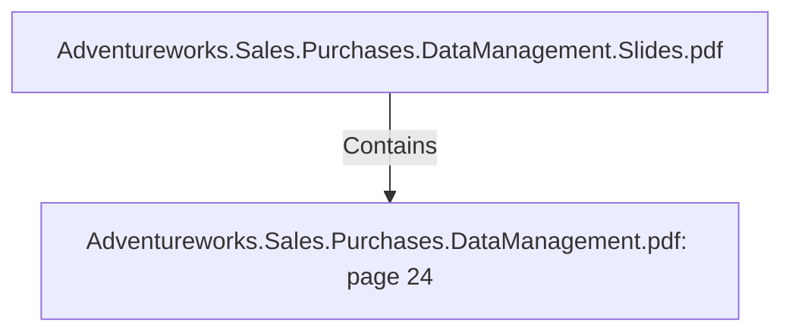

# Adventureworks.Sales.Purchases.DataManagement.pdf: page 24 (Section)

## Properties

| Key | Value |
|---|---|
| `excerpt` | 

 
 
 
 
 
 
Date  Transformation 
  

The  date  dimension  uses  an  initial  list  of  dates,   that  describe  the  minimum  and  maximum 
values  the  data  mart  transactions  can  have.  

This  is  an  initial  setup   and  it's  done  in  a  staging  database  in  MySQL 
  

The  staging  database  will  contain  seq uential  dates,   with  attribute  values  from  calculations 
that  are  easily  achieved  in  a  database  engine.   These  are:  

● Day  of  the  week  number 
● Day  of  the  week  text   
● Day  of  the  month  number 
● Day  of  the  month  text 
● Month  number 
● Month  text 
● Day  of  the  year 
● Week  of  the  year 

 
 Kettle  transformation  dim_date. ktr  |
| `page` | 24 |
| `section_index` | 23 |

## Relationships

### Contains

- ← Adventureworks.Sales.Purchases.DataManagement.Slides.pdf (`f240004c-ab01-5ee9-a371-83bdd1c54d35`) — evidence: section 24 (page 24) extracted from Adventureworks.Sales.Purchases.DataManagement.pdf

## Diagram

## Evidence

- `66e32cff-46d5-4d37-accb-6303277b4836` — section 24 (page 24) extracted from Adventureworks.Sales.Purchases.DataManagement.pdf (confidence: 1.00)
