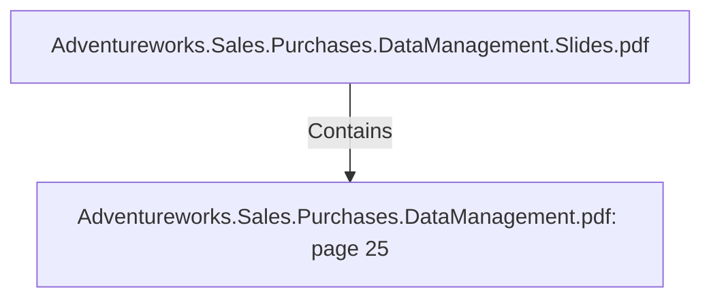

# Adventureworks.Sales.Purchases.DataManagement.pdf: page 25 (Section)

## Properties

| Key | Value |
|---|---|
| `excerpt` | 

 
 
 
 ● Quarter   

Additional  source:  Holiday 

Op en  data  is  used  to  retrieve  holidays.    

Nager  Date  is  a  p ublic  holiday  database  that  has  REST  API  endp oints  to  retrieve  holidays 
by  country  and  year.  
  

In  the  kettle  transformation,   we  extract  holidays  the  following  way:  

● Within  each  year  of  the  date  dimension  initial  sp an.    
● Call  the  Nager  Date  API  for  the  year  and  Sp ain  holidays 
● Parse  the  JSON  API  resp onse  to  obtain  date  and  holiday  name 
● Filter  only  the  nation-wide  holidays 
● Use  them  as  lookup   for  p rocessing  each  record  (day),   in  the  date  dimension 

Additional  source:  Seasons 

The  assump tion  is  that  seasons’  date  sp an  does  not  change.  

To  demonstrate  a  different  kind  of  data  source,   the  seasons  data  has  been  set  on  a  *. csv 
and  is  consumed  by  the  transformation 

  |
| `page` | 25 |
| `section_index` | 24 |

## Relationships

### Contains

- ← Adventureworks.Sales.Purchases.DataManagement.Slides.pdf (`f240004c-ab01-5ee9-a371-83bdd1c54d35`) — evidence: section 25 (page 25) extracted from Adventureworks.Sales.Purchases.DataManagement.pdf

## Diagram

## Evidence

- `cf8b94e8-f13e-4189-bdc5-db410c45895a` — section 25 (page 25) extracted from Adventureworks.Sales.Purchases.DataManagement.pdf (confidence: 1.00)
