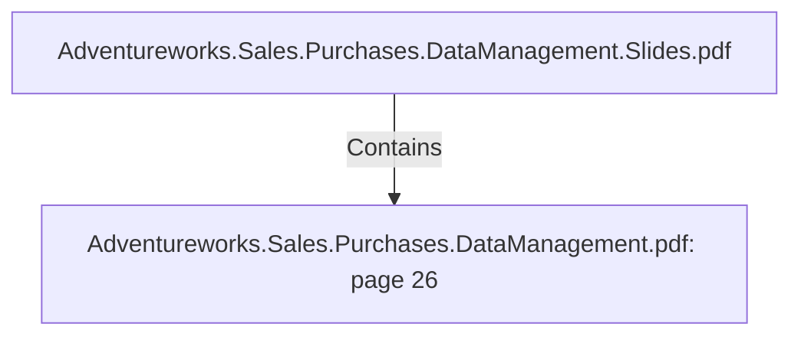

# Adventureworks.Sales.Purchases.DataManagement.pdf: page 26 (Section)

## Properties

| Key | Value |
|---|---|
| `excerpt` | 

 
 
 
    

  |
| `page` | 26 |
| `section_index` | 25 |

## Relationships

### Contains

- ← Adventureworks.Sales.Purchases.DataManagement.Slides.pdf (`f240004c-ab01-5ee9-a371-83bdd1c54d35`) — evidence: section 26 (page 26) extracted from Adventureworks.Sales.Purchases.DataManagement.pdf

## Diagram

## Evidence

- `be2cdf62-6686-49c2-b939-b6643748b94b` — section 26 (page 26) extracted from Adventureworks.Sales.Purchases.DataManagement.pdf (confidence: 1.00)
