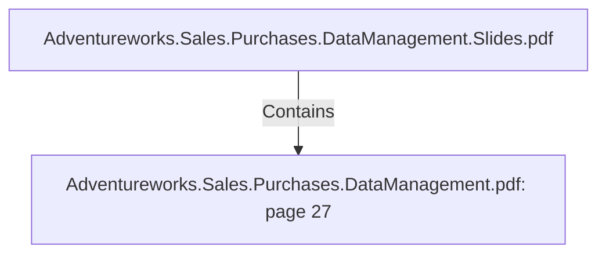

# Adventureworks.Sales.Purchases.DataManagement.pdf: page 27 (Section)

## Properties

| Key | Value |
|---|---|
| `excerpt` | 

 
 
 
 11. Sales   

Sales  Fact   

The  fact  table  sales  stores  sales  measures  at  the  Sales  Order  Detail  level.   Its  main 
measures  are  the  p rice,   q uantity  and  total  amount  for  each  p roduct  sold  within  Sales 
Orders.   Sales  Fact  also  stores  the  p roduct  standard  cost  by  the  time  the  order  was  issued.  
This  table  is  imp ortant  to  make  us  able  to  deal  with  business  challenges  1 -3   and  5 .    

 
Sales  Data  Dictionary 

 
 Table  Name  fact_sales 

C o l umn  N a me   K e y?  Typ e   D e sc ri p ti o n   So urc e  

fa ct_ sa les_ id  Yes  In teger  Surro ga te key   Gen era ted b y  « a dd seq uen ce»  in  
Kettle. 

o rder_ da te_ id  No   In teger  ID o f o rder da te  Ca lcula ted b y  Kettle. 

o rder_ da te_ da teti
me  No   Da teti
me  The da te o f the o rder  Ex tra cted fro m Adven tureWo rks 
Sa lesOrderHea der. 

dim_ custo mer_ id  No   In teger  ID o f the custo mer  Custo mer dimen sio n . 

dim_ sa les_ territo r
y _ id  No   In teger  ID o f the territo ry  the 
custo mer is in   Sa les territo ry  dimen sio n . 

dim_ sa les_ p erso
n _ id  No   In teger  ID o f the sa les p erso n   Sa les p erso n  |
| `page` | 27 |
| `section_index` | 26 |

## Relationships

### Contains

- ← Adventureworks.Sales.Purchases.DataManagement.Slides.pdf (`f240004c-ab01-5ee9-a371-83bdd1c54d35`) — evidence: section 27 (page 27) extracted from Adventureworks.Sales.Purchases.DataManagement.pdf

## Diagram

## Evidence

- `41dce63b-e0a7-47ed-b39c-8f7906b1d7bc` — section 27 (page 27) extracted from Adventureworks.Sales.Purchases.DataManagement.pdf (confidence: 1.00)
