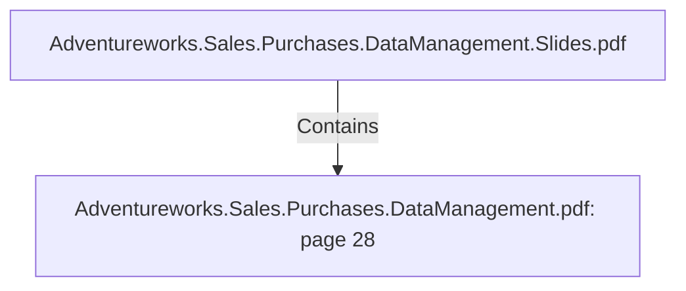

# Adventureworks.Sales.Purchases.DataManagement.pdf: page 28 (Section)

## Properties

| Key | Value |
|---|---|
| `excerpt` | 

 
 
 
 
Sales  Transformation 

 

 
 sa les_ o rder_ id  No   In teger  ID o f the o rder  Ex tra cted fro m Adven tureWo rks 
Sa lesOrderDeta il. 

sa les_ o rder_ n um
b er  No   Va rcha
r 
 The o rder n umb er 
a sso cia ted with a n  
o rder 
 Ex tra cted fro m Adven tureWo rks 
Sa lesOrderHea der. 

p ro duct_ sta n da rd
_ co st_ o n _ da y   No   Decim
a l  The sta n da rd co st o f 
the p ro duct tha t da y   Ca lcula ted b y  Kettle. 

ship _ da te_ id  No   In teger  ID o f the o rder ship  
da te  Ex tra cted fro m Adven tureWo rks 
Sa lesOrderHea der. 

ship _ da te_ da teti
me  No   Da teti
me  The da te when  the 
o rder wa s ship p ed  Ex tra cted fro m Adven tureWo rks 
Sa lesOrderHea der. 

sa les_ p ro fit  No   In teger 
 Ca lcula ted b y  
sub tra ctin g Pro duct 
Un it Price - Sta n da rd 
Pro duct Co st, times 
the o rder q ua n tity . 
 Pro duct un it p rice a n d q ua n tity  
ex tra cted fro m Aven tureWo rks 
Sa leOrderhea der. Ca lcula ted 
sta n da rd p ro duct co st fro m DW 

Kettle  transformation  fact_sales. ktr  |
| `page` | 28 |
| `section_index` | 27 |

## Relationships

### Contains

- ← Adventureworks.Sales.Purchases.DataManagement.Slides.pdf (`f240004c-ab01-5ee9-a371-83bdd1c54d35`) — evidence: section 28 (page 28) extracted from Adventureworks.Sales.Purchases.DataManagement.pdf

## Diagram

## Evidence

- `630c68fe-ceb4-4936-a82b-53328d261d56` — section 28 (page 28) extracted from Adventureworks.Sales.Purchases.DataManagement.pdf (confidence: 1.00)
