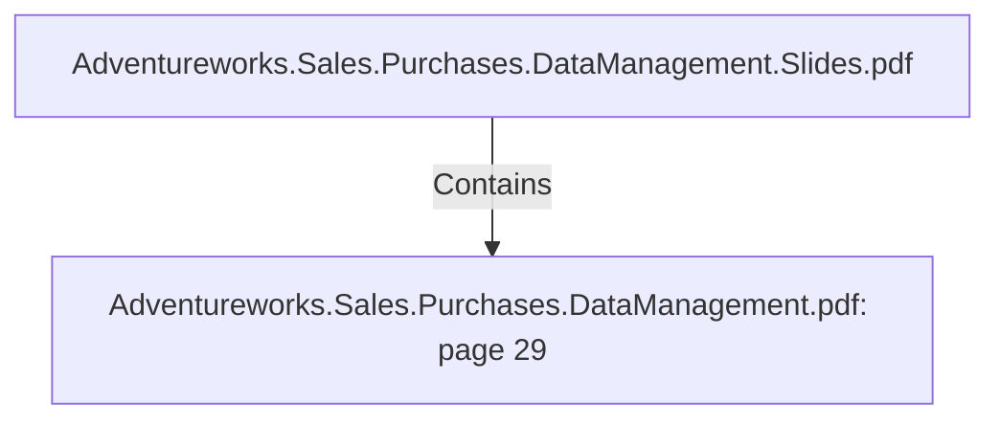

# Adventureworks.Sales.Purchases.DataManagement.pdf: page 29 (Section)

## Properties

| Key | Value |
|---|---|
| `excerpt` | 

 
 
 
  

 
Sales  Fact  table  is  based  on  Sales  Order  Detail.   It  lookup s  information  from  Sales  Order 
Header.   At  this  stage,   order  and  ship   dates  are  calculated  to  match  Date  Dimensions  IDs.  

This  is  an  examp le  of  how  the  surrogate  date  dimension  key  is  calculated,   based  on  Order 
Date:  

[ order_date_year] *1 0 0 0 0   +  [ order_date_month] *1 0 0   +  [ order_date_day]  

Product  Standard  Cost  is  calculated  by  looking  into  the  Product  Cost  History  table  and 
finding  the  correct  cost  date  range,   based  on  the  Order  Date.  

Finally,   Sales  Profit  is  calculated  by  subtracting  Product  Unit  Price  -  Standard  Product 
Cost,   times  the  order  q uantity.  

 

  |
| `page` | 29 |
| `section_index` | 28 |

## Relationships

### Contains

- ← Adventureworks.Sales.Purchases.DataManagement.Slides.pdf (`f240004c-ab01-5ee9-a371-83bdd1c54d35`) — evidence: section 29 (page 29) extracted from Adventureworks.Sales.Purchases.DataManagement.pdf

## Diagram

## Evidence

- `d03f61aa-4784-4445-ba12-85f46f635387` — section 29 (page 29) extracted from Adventureworks.Sales.Purchases.DataManagement.pdf (confidence: 1.00)
