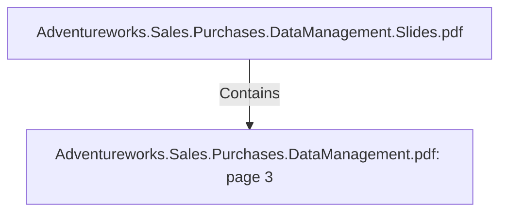

# Adventureworks.Sales.Purchases.DataManagement.pdf: page 3 (Section)

## Properties

| Key | Value |
|---|---|
| `excerpt` | 

 
 
 
 Dimensions  Job 3 3  

Facts  Job 3 4  

Conclusions 3 5  

Appendix 3 9  

  
   

  |
| `page` | 3 |
| `section_index` | 2 |

## Relationships

### Contains

- ← Adventureworks.Sales.Purchases.DataManagement.Slides.pdf (`f240004c-ab01-5ee9-a371-83bdd1c54d35`) — evidence: section 3 (page 3) extracted from Adventureworks.Sales.Purchases.DataManagement.pdf

## Diagram

## Evidence

- `5ec39f08-381a-4b98-839a-3bc49bf427f0` — section 3 (page 3) extracted from Adventureworks.Sales.Purchases.DataManagement.pdf (confidence: 1.00)
