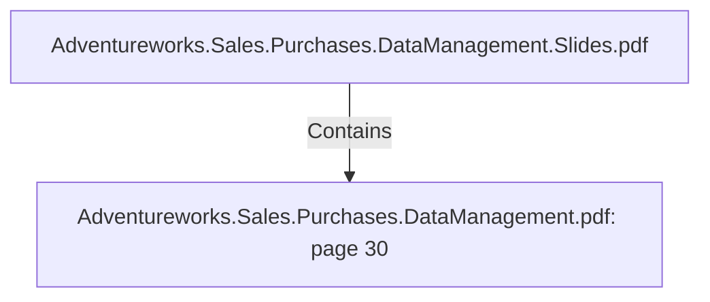

# Adventureworks.Sales.Purchases.DataManagement.pdf: page 30 (Section)

## Properties

| Key | Value |
|---|---|
| `excerpt` | 

 
 
 
   

  |
| `page` | 30 |
| `section_index` | 29 |

## Relationships

### Contains

- ← Adventureworks.Sales.Purchases.DataManagement.Slides.pdf (`f240004c-ab01-5ee9-a371-83bdd1c54d35`) — evidence: section 30 (page 30) extracted from Adventureworks.Sales.Purchases.DataManagement.pdf

## Diagram

## Evidence

- `0b2b4035-473c-4ac7-bb6d-314457d022ad` — section 30 (page 30) extracted from Adventureworks.Sales.Purchases.DataManagement.pdf (confidence: 1.00)
