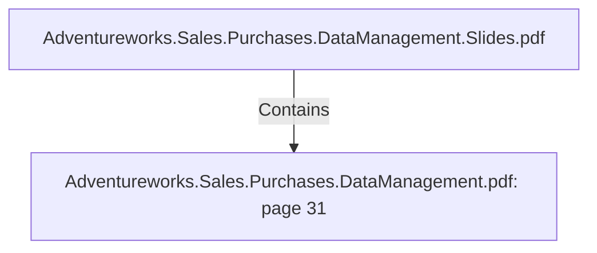

# Adventureworks.Sales.Purchases.DataManagement.pdf: page 31 (Section)

## Properties

| Key | Value |
|---|---|
| `excerpt` | 

 
 
 
 12. Purchases 

Purchases  Fact   

The  p urchase  Fact  contains  all  the  info  about  the  trading  p rocess  of  the  p roduct,   how  many 
was  rejected,   received,   and  stocked  and  what  is  the  p rice  of  them.   A  boolean  value  exists 
to  indicate  if  the  p roduct  is  delivered  or  not.  

PurchasesData  Dictionary 

 
 Table  Name  fact_p urchases 

C o l umn  N a me   K e y?  Typ e   Descrip tio n   So urc e  

fa ct_ p urcha ses
_ id  Yes  In teger  Surro ga te key   Gen era ted in  the my Sq l DB usin g the a dd 
seq uen ce fea ture in  kettle 

dim_ p ro duct_ id  No   In teger  ID o f the 
p ro duct  Fo reign  key  fro m ta b le dim_ p ro duct My Sq l 
da ta b a se 

p ro duct_ un it_ p
rice  No   In teger  Un it p rice o f the 
p ro duct  Adven tureWo rks Purcha seOrderDeta il 

rejected_ q ty   No   In teger  Qua n tity  o f 
rejected items  Adven tureWo rks Purcha seOrderDeta il 

received_ q ty   No   In teger  Qua n tity  o f 
items received 
fro m the ven do r  Adven tureWo rks Purcha seOrderDeta il 

sto cked_ q ty   No   In teger  Qua n tity  o f 
a ccep ted items 
in to  in ven to ry   Adven tureWo rks Purcha seOrderDeta il 

p ro d |
| `page` | 31 |
| `section_index` | 30 |

## Relationships

### Contains

- ← Adventureworks.Sales.Purchases.DataManagement.Slides.pdf (`f240004c-ab01-5ee9-a371-83bdd1c54d35`) — evidence: section 31 (page 31) extracted from Adventureworks.Sales.Purchases.DataManagement.pdf

## Diagram

## Evidence

- `356058ff-2b12-43f9-b797-50db143ae951` — section 31 (page 31) extracted from Adventureworks.Sales.Purchases.DataManagement.pdf (confidence: 1.00)
