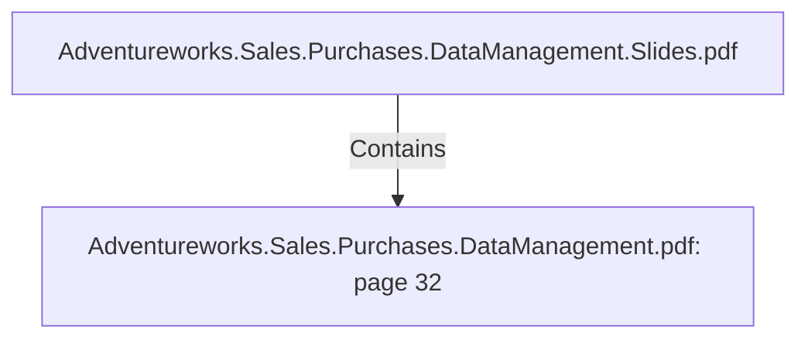

# Adventureworks.Sales.Purchases.DataManagement.pdf: page 32 (Section)

## Properties

| Key | Value |
|---|---|
| `excerpt` | 

 
 
 
 
Purchases  Transformation 

 
  

 
The  FactPurchase  transformation  de-normalizes  tables  orderDetail,   Orderheader,  
dim_Product,   and  dim_vendor  by  doing  lookup s.    

The  calculator  function  was  used  to  differentiate  between  year,   month, and  day  for  the 
orderDate  and  the  ship Date.  

The  javaScrip t  code  was  used  to  check  if  the  order  was  received  or  not.  

 
 1  = received 
a n d 0  = n o t 
received 

due_ da te_ id  No   In teger  Da te the o rder 
is due 
 Fo riegn  key  fo r ta b le dim_ da te co n verted 
usin g kettle to  ma tch 
the in teger va lue in  the co lumn  o f the 
dim_ da te ta b le 

dim_ ven do r_ id  No   In teger  ID o f the ven do r  Fo reign  key  fro m ta b le dim_ ven do r My Sq l 
da ta b a se 

Kettle  transformation  fact_p urchases. ktr  |
| `page` | 32 |
| `section_index` | 31 |

## Relationships

### Contains

- ← Adventureworks.Sales.Purchases.DataManagement.Slides.pdf (`f240004c-ab01-5ee9-a371-83bdd1c54d35`) — evidence: section 32 (page 32) extracted from Adventureworks.Sales.Purchases.DataManagement.pdf

## Diagram

## Evidence

- `c9e95bac-c41b-4263-aa9d-4e9d2868d0ba` — section 32 (page 32) extracted from Adventureworks.Sales.Purchases.DataManagement.pdf (confidence: 1.00)
