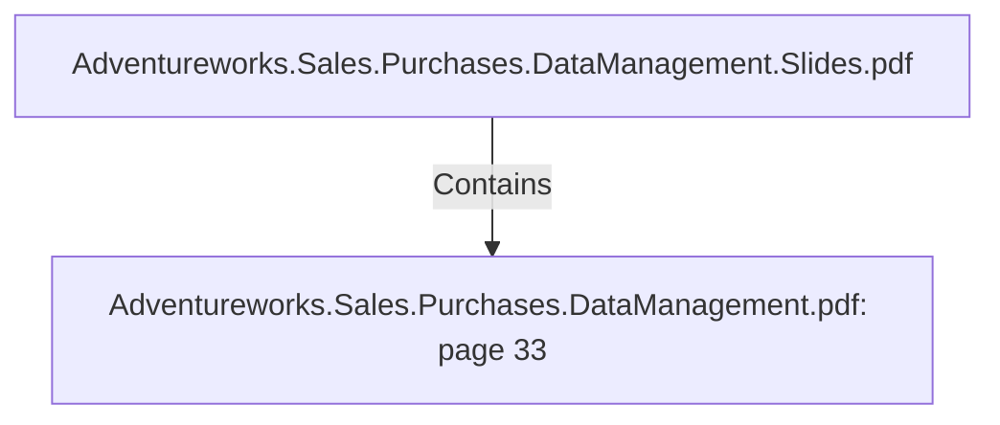

# Adventureworks.Sales.Purchases.DataManagement.pdf: page 33 (Section)

## Properties

| Key | Value |
|---|---|
| `excerpt` | 

 
 
 
 13. Job  Scheduling 

The  ETL  p rocess  has  been  sp litted  in  two  sections 

Dimensions  Job 

This  Job  launches  the  transformations  for  the  dimension  tables.  

 

   

 
 Kettle  job  DimensionsJob. kjb  |
| `page` | 33 |
| `section_index` | 32 |

## Relationships

### Contains

- ← Adventureworks.Sales.Purchases.DataManagement.Slides.pdf (`f240004c-ab01-5ee9-a371-83bdd1c54d35`) — evidence: section 33 (page 33) extracted from Adventureworks.Sales.Purchases.DataManagement.pdf

## Diagram

## Evidence

- `9eb550ac-7437-4da1-92fb-7a455e29de4f` — section 33 (page 33) extracted from Adventureworks.Sales.Purchases.DataManagement.pdf (confidence: 1.00)
