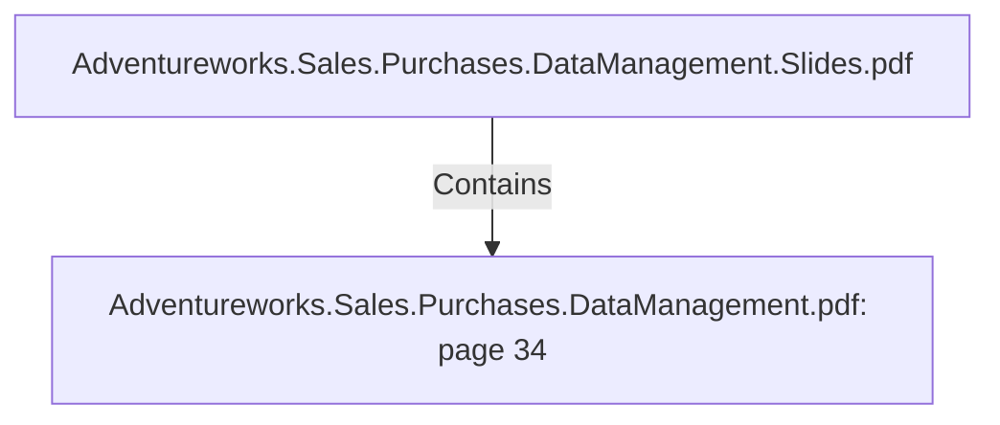

# Adventureworks.Sales.Purchases.DataManagement.pdf: page 34 (Section)

## Properties

| Key | Value |
|---|---|
| `excerpt` | 

 
 
 
Facts  Job 

This  Job  launches  the  transformations  for  the  fact  tables.   It  has  a  dep endency  to  the 
Dimensions  Job,   so  that  fact  tables  are  always  built  with  up -to-date  dimension  records 
  

 
 
 
 
   

 
 Kettle  job  FactsJob. kjb  |
| `page` | 34 |
| `section_index` | 33 |

## Relationships

### Contains

- ← Adventureworks.Sales.Purchases.DataManagement.Slides.pdf (`f240004c-ab01-5ee9-a371-83bdd1c54d35`) — evidence: section 34 (page 34) extracted from Adventureworks.Sales.Purchases.DataManagement.pdf

## Diagram

## Evidence

- `e48f8e83-8145-41d1-8c21-4de2d038fe80` — section 34 (page 34) extracted from Adventureworks.Sales.Purchases.DataManagement.pdf (confidence: 1.00)
