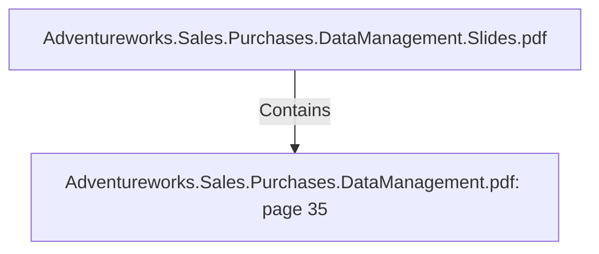

# Adventureworks.Sales.Purchases.DataManagement.pdf: page 35 (Section)

## Properties

| Key | Value |
|---|---|
| `excerpt` | 

 
 
 
 14. Conclusions   

In  this  section  we  look  at  the  answer  to  the  business  challenges.  

 
 1 . Analyze  reseller  sales  vs  direct  consumer  sales 
over  sp ecific  holiday  days.  
  

Looking  sp ecifically  at  reseller  sales  vs  direct  consumer  sales  over    holidays  we  find 
the  existence  of  sales  to  individual  costumer  across  all  holiday  days.   Regarding 
resellers  the  only  sale  during  holiday  days  seem  to  be  in  the  New  Year’s  Day.   This 
visualization  is  filtered  on  2 0 1 2   sp ecifically.   The  second  visualization  looks  at 
reseller  sales  and  direct  consumer  sales  month  by  month.   One  insight  from  this  is 
seeing  how  resellers  seem  to  be  a  more  imp ortant  segment  in  terms  of  sales  for 
AdventureWorks.    

 

  |
| `page` | 35 |
| `section_index` | 34 |

## Relationships

### Contains

- ← Adventureworks.Sales.Purchases.DataManagement.Slides.pdf (`f240004c-ab01-5ee9-a371-83bdd1c54d35`) — evidence: section 35 (page 35) extracted from Adventureworks.Sales.Purchases.DataManagement.pdf

## Diagram

## Evidence

- `c36cefb9-c559-484f-a176-432af973dbe8` — section 35 (page 35) extracted from Adventureworks.Sales.Purchases.DataManagement.pdf (confidence: 1.00)
