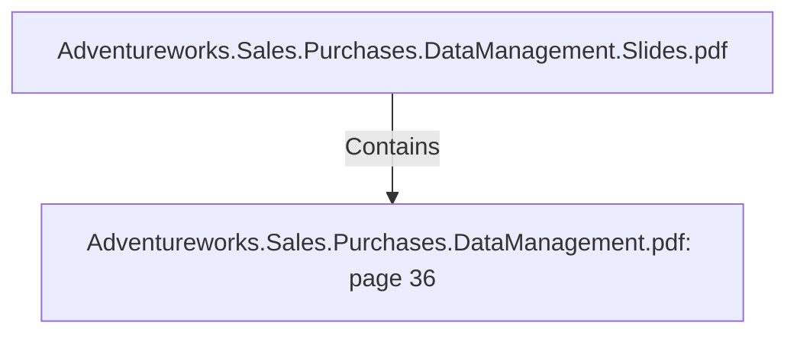

# Adventureworks.Sales.Purchases.DataManagement.pdf: page 36 (Section)

## Properties

| Key | Value |
|---|---|
| `excerpt` | 

 
 
 
 2 . Create  top   5   p roducts  sales  ranking  by  seasons.  
  

This  visualization  shows  the  top   five  p roduct  sales  ranked  by  seasons.   The  most 
sales  seem  to  be  done  around  Autumn  and  Summer.   The  top   p roducts  are  all 
Mountain  Bikes,   but  with  different  colors  or  sizes.   This  visualization  looks  at  2 0 1 3  
sp ecifically.  

3 . Create  top   5   p roducts  p rofit  ranking,   q uarter  by 
q uarter 
  

  |
| `page` | 36 |
| `section_index` | 35 |

## Relationships

### Contains

- ← Adventureworks.Sales.Purchases.DataManagement.Slides.pdf (`f240004c-ab01-5ee9-a371-83bdd1c54d35`) — evidence: section 36 (page 36) extracted from Adventureworks.Sales.Purchases.DataManagement.pdf

## Diagram

## Evidence

- `e14e4246-e5f4-46d7-95fe-35a5e20e5439` — section 36 (page 36) extracted from Adventureworks.Sales.Purchases.DataManagement.pdf (confidence: 1.00)
