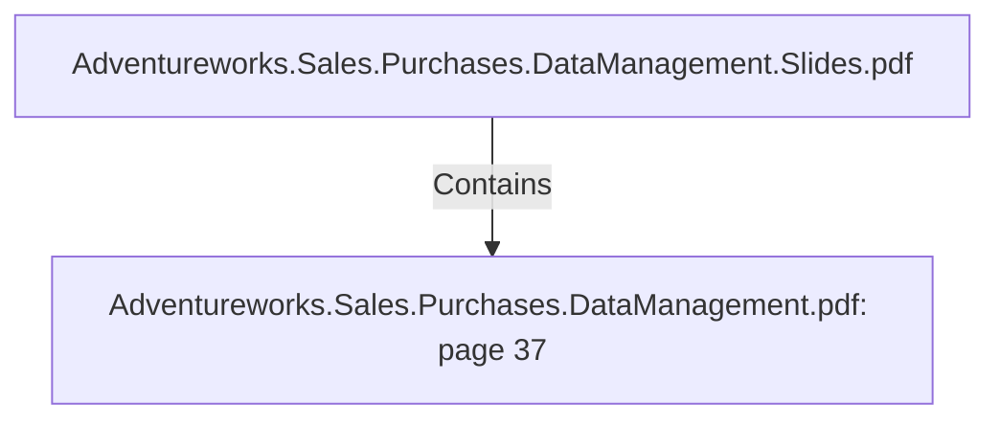

# Adventureworks.Sales.Purchases.DataManagement.pdf: page 37 (Section)

## Properties

| Key | Value |
|---|---|
| `excerpt` | 

 
 
 
 4 . Create  a  top   5   Vendor  ranking  of  rejected  items  on 
p urchase  orders.    
  

These  two  visualizations  show  the  top   5   vendors  in  terms  of  order  amount  and  rejected 
amount.   Vendors  who  we  order  a  lot  of  p roducts  from,   also  have  a  high  amount  of  rejected 
p roducts  relative  to  other  vendors.    

5 . See  in  a  single  view  sold  items  vs  p urchased  items,  
for  each  p roduct  category 

In  general  these  two  visualizations  show  interesting  information  regarding  which  p roduct 
categories  AdventureWorks  are  earning  and  sp ending  the  most  money  on.    

  |
| `page` | 37 |
| `section_index` | 36 |

## Relationships

### Contains

- ← Adventureworks.Sales.Purchases.DataManagement.Slides.pdf (`f240004c-ab01-5ee9-a371-83bdd1c54d35`) — evidence: section 37 (page 37) extracted from Adventureworks.Sales.Purchases.DataManagement.pdf

## Diagram

## Evidence

- `0172e28d-7b2b-4904-a9ea-f19270f5f44b` — section 37 (page 37) extracted from Adventureworks.Sales.Purchases.DataManagement.pdf (confidence: 1.00)
