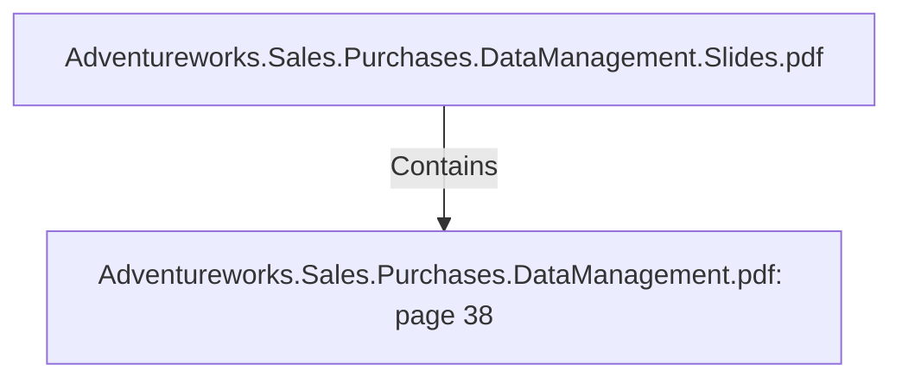

# Adventureworks.Sales.Purchases.DataManagement.pdf: page 38 (Section)

## Properties

| Key | Value |
|---|---|
| `excerpt` | 

 
 
 
  

2 0 1 1   Mostly  bikes  and  comp onents.   Purchases  might  not  be  recorded  in  this  year.  

 
  

2 0 1 3   Bikes  is  still  the  most  sold  category.   Comp onents,   Accessories  and  Clothing 
p urchases  exceed  the  sales  amount  for  these  sp ecific  categories.    

  |
| `page` | 38 |
| `section_index` | 37 |

## Relationships

### Contains

- ← Adventureworks.Sales.Purchases.DataManagement.Slides.pdf (`f240004c-ab01-5ee9-a371-83bdd1c54d35`) — evidence: section 38 (page 38) extracted from Adventureworks.Sales.Purchases.DataManagement.pdf

## Diagram

## Evidence

- `a07e0b6c-1657-4a8d-9bd9-ded939b82de0` — section 38 (page 38) extracted from Adventureworks.Sales.Purchases.DataManagement.pdf (confidence: 1.00)
