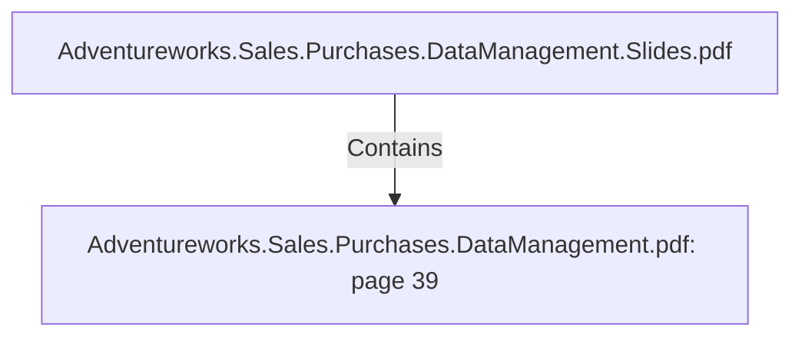

# Adventureworks.Sales.Purchases.DataManagement.pdf: page 39 (Section)

## Properties

| Key | Value |
|---|---|
| `excerpt` | 

 
 
 
 Appendix   

1. Source  Database   

 

 
2.Staging  Database 

To  setup  the sta gin g da ta b a se ex ecute DDL Scrip t a n d then  DML. 
 

 
3.Additional  Data  Source 

This  file  should  be  in  the  same  folder  as  the  dim_date  transformation.  
 

 
4.Destination  Database 

To  setup  the destin a tio n  da ta b a se ex ecute DDL Scrip t a t My  SQL Wo rkb en ch.  
 

 

 
 Da ta b a se En gin e  Micro so ft SQL Server 

Da ta b a se Na me  Adven tureWo rks2 0 1 9  

Da ta b a se En gin e  My  SQL  

Da ta b a se Na me  s t a g i n g _ d a t a _ m a n a g e m e n t _ m m j j a  

DDL Setup  Scrip t  . \ D B   S c r i p t s \ D e s t i n a t i o n   M y S Q L \  
c r e a t e . s t a g i n g _ d a t a _ m a n a g e m e n t _ m m j j a . s q l  

DML Setup  Scrip t  . \ D B   S c r i p t s \ D e s t i n a t i o n   M y S Q L \  
i n i t . s t a g i n g _ d a t a _ m a n a g e m e n t _ m m j j a . s q l  

Sea so n s csv file  s e a s o n s _ b y _ m o n t h . c s v  

Da ta b a se En gin e  My  SQL  

Da ta b a se Na me  e a e _ d a t a _ m a n a g e m e n t _ m m j j a  

DDL Setup  Scrip t  . \ D B   S c r i p t s \ D e s t i n a t i o n   M y S Q L \  
c r  |
| `page` | 39 |
| `section_index` | 38 |

## Relationships

### Contains

- ← Adventureworks.Sales.Purchases.DataManagement.Slides.pdf (`f240004c-ab01-5ee9-a371-83bdd1c54d35`) — evidence: section 39 (page 39) extracted from Adventureworks.Sales.Purchases.DataManagement.pdf

## Diagram

## Evidence

- `0c6fa3e1-d298-4101-8d96-c4537947fa6b` — section 39 (page 39) extracted from Adventureworks.Sales.Purchases.DataManagement.pdf (confidence: 1.00)
