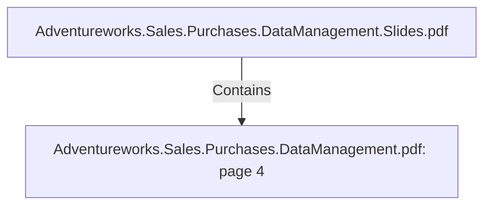

# Adventureworks.Sales.Purchases.DataManagement.pdf: page 4 (Section)

## Properties

| Key | Value |
|---|---|
| `excerpt` | 

 
 
 
 

 Executive  Summary 

 
Adventure  Works  Cycles  is  a  multinational  bicycle  manufacturer  that  records  data 
from  its  op erations  in  a  database  that  is  op timized  for  Online  Transaction  Processing 
(OLTP).   The  comp any  transactions  recorded  are  from  the  following  business 
p rocesses:   Manufacturing,   Sales,   Purchasing,   Product  Management,   Contact 
Management,   and  Human  Resources.   Some  data  discovery  shows  that  the  comp any 
has  around  9 7   brands  of  different  bikes,   group ed  into  mountain  bikes,   road  bikes,   and 
touring  bikes.   They  manufacture  some  comp onents  themselves,   but  also  buy 
comp onents,   accessories,   and  clothing  from  outside  vendors.   They  sell  to  both  retail 
stores,   which  we  have  defined  as  resellers  and  individual  customers.    

The  comp any,   in  order  to  imp rove  business  p erformance  needs  to  obtain  insights  from 
its  op erations.   Getting  insights  from  an  OLTP  database  has  been  p roven  challenging  in 
the  p ast,   therefore  Adventure  Works  Cycles  will  start  to  build  datamarts  that  comp ly 
with  an  Online  Analytical  |
| `page` | 4 |
| `section_index` | 3 |

## Relationships

### Contains

- ← Adventureworks.Sales.Purchases.DataManagement.Slides.pdf (`f240004c-ab01-5ee9-a371-83bdd1c54d35`) — evidence: section 4 (page 4) extracted from Adventureworks.Sales.Purchases.DataManagement.pdf

## Diagram

## Evidence

- `78f149d0-adb9-46c3-bbb6-df6e63c7b76a` — section 4 (page 4) extracted from Adventureworks.Sales.Purchases.DataManagement.pdf (confidence: 1.00)
