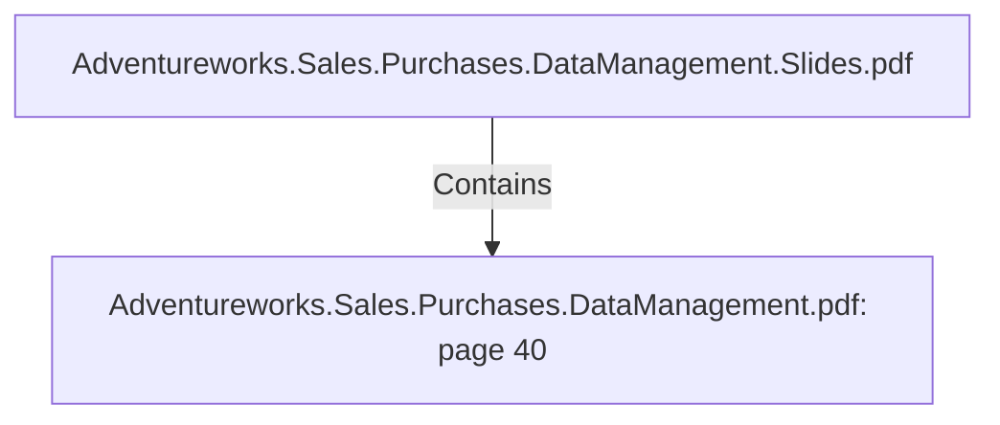

# Adventureworks.Sales.Purchases.DataManagement.pdf: page 40 (Section)

## Properties

| Key | Value |
|---|---|
| `excerpt` | 

 
 
 
  
5.ETL  files 

 
 
 Custo mer tra n sfo rma tio n   d i m _ c u s t o m e r . k t r  

Da te tra n sfo rma tio n   d i m _ d a t e . k t r  
Dep en den cies: 
● . / s e a s o n s _ b y _ m o n t h . c s v  
● Co n n ectivity  to  http s://da te.n a ger.a t 
 

Pro duct Tra n sfo rma tio n   d i m _ p r o d u c t . k t r  

Sa les Perso n  Tra n sfo rma tio n   d i m _ s a l e s _ p e r s o n . k t r  

Sa les Territo ry  Tra n sfo rma tio n   d i m _ s a l e s _ t e r r i t o r y . k t r  

Ven do r tra n sfo rma tio n   d i m _ v e n d o r . k t r  

Purcha ses tra n sfo rma tio n   f a c t _ p u r c h a s e . k t r  
 

Sa les tra n sfo rma tio n   f a c t _ s a l e s . k t r  
 When  testin g fa ct_ sa les tra n sfo rma tio n , co n sider 
restrictin g the Sa les Order Deta il in p ut to  these 
o rders. 
These will reduce the da ta  flo w vo lume, fo r 
ta kin g a  sa mp le o f the en tire sa les.  
If ta ken  in to  co n sidera tio n  the en tire 
Sa lesOrderDeta il ta b le, it ta kes fro m 6  to  1 0  
ho urs to  fin ish. This is o n  a  la p to p  run n in g a n  
In tel6 4  Fa mily  6  Mo del 7 8  Step p in g 3  
Gen uin eIn tel ~2 4 9 2  Mhz , 1 6  Gb  o f RAM a |
| `page` | 40 |
| `section_index` | 39 |

## Relationships

### Contains

- ← Adventureworks.Sales.Purchases.DataManagement.Slides.pdf (`f240004c-ab01-5ee9-a371-83bdd1c54d35`) — evidence: section 40 (page 40) extracted from Adventureworks.Sales.Purchases.DataManagement.pdf

## Diagram

## Evidence

- `b59f7618-17f9-41ee-b6c0-b406197b3bb0` — section 40 (page 40) extracted from Adventureworks.Sales.Purchases.DataManagement.pdf (confidence: 1.00)
