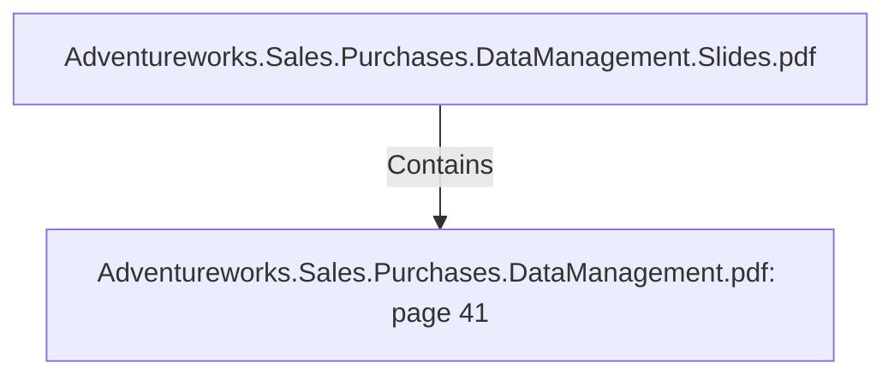

# Adventureworks.Sales.Purchases.DataManagement.pdf: page 41 (Section)

## Properties

| Key | Value |
|---|---|
| `excerpt` | 

 
 
 
  
 
6.Testing  scenarios  scripts 

Enclosed  there  are  also  4   test  scenarios  that  need  scrip ts  to  be  executed  at  the 
source  and  destination  databases.  

 
 

 
 Dep en den cies: 
● . / d i m _ * . k t r   (6  files a b o ve men tio n ed) 

Fa ct Ta b les Jo b    F a c t s J o b . k j b  
Dep en den cies: 
● . / D i m e n s i o n s J o b . k j b  
● . / f a c t _ p u r c h a s e . k t r  
● . / f a c t _ s a l e s . k t r  

So urce MSSQL  . \ D B   S c r i p t s \ S o u r c e  
M S S Q L \ t r a n s a c t i o n a l . t e s t i n g . s c e n a r i o s  

Destin a tio n  My SQL  . \ D B   S c r i p t s \ D e s t i n a t i o n  
M y S Q L \ d a t a m a r t . t e s t i n g . s c e n a r i o s . s q l   |
| `page` | 41 |
| `section_index` | 40 |

## Relationships

### Contains

- ← Adventureworks.Sales.Purchases.DataManagement.Slides.pdf (`f240004c-ab01-5ee9-a371-83bdd1c54d35`) — evidence: section 41 (page 41) extracted from Adventureworks.Sales.Purchases.DataManagement.pdf

## Diagram

## Evidence

- `f6d9e4ca-a918-4622-9793-1648da4e73e2` — section 41 (page 41) extracted from Adventureworks.Sales.Purchases.DataManagement.pdf (confidence: 1.00)
